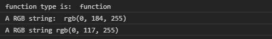
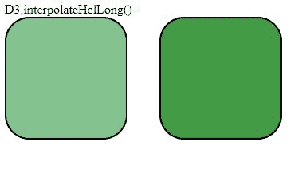

# D3.js 插值 clLong()函数

> 原文:[https://www . geeksforgeeks . org/D3-js-插值 ehcllong-function/](https://www.geeksforgeeks.org/d3-js-interpolatehcllong-function/)

D3.js 中的 **d3 .插值 eHclLong()** 函数用于返回两种颜色之间的 CIELCh <sub>ab</sub> 颜色空间插值函数。它与插值 cl()函数几乎相同，但两者之间唯一的区别是它没有使用色调之间的最短路径。

**语法:**

```
d3.interpolateHclLong(a, b);
```

**参数:**取以下两个参数。

*   **a:** 是颜色串。
*   **b:** 是颜色串。它与第一种颜色的混合量由插值决定(0 < =x < =1)

**注意:**如果 x=1，则 b 的一部分大于 0，a 的一部分返回颜色。改变 x 的值，看到不同深浅的颜色。

**返回:**下面给出了上述函数的几个例子。

**例 1:**

```
<!DOCTYPE html>
<html lang="en">
<head>
  <meta charset="UTF-8">
  <meta name="viewport" 
        content="width=device-width,
                 initial-scale=1.0">
  <title>Document</title>
</head>
<style>
</style>
<body>
  <!--fetching from CDN of D3.js -->
  <script type = "text/javascript" 
          src = "https://d3js.org/d3.v4.min.js">
  </script>
  <script>
    // Printing the return type of the function
    console.log("function type is: ",
 typeof(d3.interpolateHclLong("blue", "white")))
    // Using function d3.interpolateHclLong()
    console.log("A RGB string: ",
 d3.interpolateHclLong("blue", "white")(0.5))
    console.log("A RGB string",
 d3.interpolateHclLong("blue", "white")(0.2))
  </script>
</body>
</html>
```

**输出:**



**例 2:**

```
<!DOCTYPE html>
<html lang="en">
<head>
  <meta charset="UTF-8">
  <meta name="viewport" 
        content="width=device-width, 
                 initial-scale=1.0">
  <title>Document</title>
</head>
<style>
  .box1, .box2{
    display: flex;
    margin-right: 40px;
    border-radius: 20% 20%;
    border: 2px solid black;
    width: 150px;
    height: 150px;
  }
  div{
    display: flex;
  }
</style>
<body>
  D3.interpolateHclLong()
  <div>
    <div class="box1">
    </div>
    <div class="box2">
    </div>
  </div>
  <!--fetching from CDN of D3.js -->
  <script type = "text/javascript" 
          src = "https://d3js.org/d3.v4.min.js">
  </script>
  <script>
    let box1=document.querySelector(".box1");
    let box2=document.querySelector(".box2");
    let color=d3.interpolateHclLong("green", "white")(0.5);
    let color2=d3.interpolateHclLong("green", "white")(0.2); 
    // Changing css of the div with class-name box1
    box1.style.backgroundColor=color;
    // Changing css of the div with class-name box2
    box2.style.backgroundColor=color2;
  </script>
</body>
</html>
```

**输出:**

