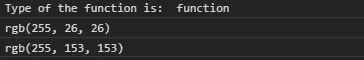
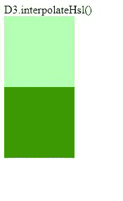

# D3.js 插值函数

> 原文:[https://www . geesforgeks . org/D3-js-插值 ehsl-function/](https://www.geeksforgeeks.org/d3-js-interpolatehsl-function/)

D3.js 的 **d3 .插值器 Hsl()** 函数用于返回两个给定颜色的 Hsl 颜色空间插值器函数。给出的颜色不能是 HSL 格式。

**语法:**

```
d3.interpolateHsl(a, b);
```

**参数:**取两个参数:

*   **a:** 是一个颜色名称，例如红色或绿色。
*   **b:** 也是一个颜色名称，如红色或绿色。

**返回:**返回插值函数。

下面给出了上述函数的几个例子。

**示例 1:** 使用控制台中的功能。

```
<!DOCTYPE html>
<html lang="en">
<head>
  <meta charset="UTF-8">
  <meta name="viewport" 
        content="width=device-width, 
                 initial-scale=1.0">
  <title>Document</title>
</head>
<style>
</style>
<body>
  <!--fetching from CDN of D3.js -->
  <script type = "text/javascript" 
          src = "https://d3js.org/d3.v4.min.js">
  </script>
  <script>
    console.log("Type of the function is: ",
 typeof(d3.interpolateHsl("white", "red")))
    console.log(d3.interpolateHsl("white", "red")(0.9))
    console.log(d3.interpolateHsl("white", "red")(0.4))
  </script>
</body>
</html>
```

**输出:**



**例 2:** 使用 HTML 中的函数。

```
<!DOCTYPE html>
<html lang="en">
<head>
  <meta charset="UTF-8">
  <meta name="viewport" 
        content="width=device-width,
                 initial-scale=1.0">
  <title>Document</title>
</head>
<style>
  div{
    width: 100px;
    height: 100px;
  }
</style>
<body>
  D3.interpolateHsl()
  <div class="b1">
  </div>
  <div class="b2">
  </div>
  <!--fetching from CDN of D3.js -->
  <script type = "text/javascript" 
          src = "https://d3js.org/d3.v4.min.js">
  </script>
  <script>
    let color=d3.interpolateHsl("white", "green")(0.2);
    let color2=d3.interpolateHsl("red", "green")(0.8);
    let b1=document.querySelector(".b1");
    let b2=document.querySelector(".b2");
    b1.style.backgroundColor=color;
    b2.style.backgroundColor=color2;
  </script>
</body>
</html>
```

**输出:**

