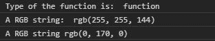
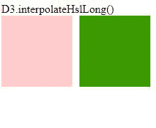

# D3.js 插值函数

> 原文:[https://www . geeksforgeeks . org/D3-js-插值 ehsllong-function/](https://www.geeksforgeeks.org/d3-js-interpolatehsllong-function/)

D3.js 的 **d3 .插值器 HslLong()** 函数和插值器 Hsl()函数几乎一样，两者唯一的区别是这个函数没有使用两种色调之间的最短路径。

**语法:**

```
d3.interpolateHslLong(a, b);
```

**参数:**取两个参数:

*   **a:** 是类型字符串颜色的名称。
*   **b:** 也是颜色的名称。

**返回:**返回插值函数。

下面给出了几个 d3 .插值 slLong()函数的例子。

**示例 1:** 使用控制台中的功能。

```
<!DOCTYPE html>
<html lang="en">
<head>
  <meta charset="UTF-8">
  <meta name="viewport" 
        content="width=device-width,
                  initial-scale=1.0">
  <title>Document</title>
</head>
<style>
</style>
<body>
  <!--fetching from CDN of D3.js -->
  <script type = "text/javascript" 
          src = 
"https://d3js.org/d3.v4.min.js">
   </script>
  <script>
    // Printing the return type of the function
    console.log("Type of the function is: ",
 typeof(d3.interpolateHslLong("green", "yellow")))
    console.log(
"A RGB string: ", d3.interpolateHslLong("white", "yellow")(0.435))
    console.log(
"A RGB string", d3.interpolateHslLong("white", "green")(0.888996))
  </script>
</body>
</html>
```

**输出:**



**例 2:** 使用 HTML 中的函数。

```
<!DOCTYPE html>
<html lang="en">
<head>
  <meta charset="UTF-8">
  <meta name="viewport" 
        content="width=device-width,
                 initial-scale=1.0">
  <title>Document</title>
</head>
<style>
  .box1, .box2{
    display: flex;
    margin-right: 10px;
    width: 100px;
    height: 100px;
  }
  div{
    display: flex;
  }
</style>
<body>
  D3.interpolateHslLong()
  <div>
    <div class="box1">
    </div>
    <div class="box2">
    </div>
  </div>
  <!--fetching from CDN of D3.js -->
  <script type = "text/javascript" 
          src = "https://d3js.org/d3.v4.min.js">
</script>
  <script>
    let b1=document.querySelector(".box1");
    let b2=document.querySelector(".box2");
    let color=d3.interpolateHslLong("white", "red", "green")(0.2);
    let color2=d3.interpolateHslLong("red", "green")(0.8);
    b1.style.backgroundColor=color;
    b2.style.backgroundColor=color2;
  </script>
</body>
</html>
```

**输出:**

