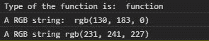
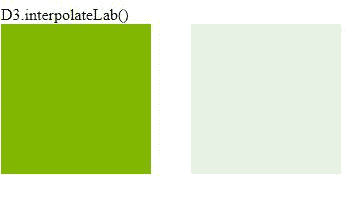

# D3.js 插值 eLab()函数

> 原文:[https://www . geeksforgeeks . org/D3-js-插值 elab-function/](https://www.geeksforgeeks.org/d3-js-interpolatelab-function/)

D3.js 中的**插值 eLab()** 函数用于返回两个给定颜色之间的 CIELAB 颜色空间插值器。中作为参数给出的颜色不要求是 CIELAB 格式。简单的颜色名称可以稍后给出，它们由内置函数 d3.lab()转换为 CIELAB 格式。

**语法:**

```
d3.interpolateLab(a, b);
```

**参数:**取以下两个参数:

*   **a:** 是数据类型字符串颜色的名称。
*   **b:** 是数据类型字符串颜色的名称。

**返回:**返回插值函数。

下面给出了上述函数的几个例子。

**例 1:** 在控制台打印颜色。

```
<!DOCTYPE html>
<html lang="en">
<head>
  <meta charset="UTF-8">
  <meta name="viewport"
        content="width=device-width, 
                 initial-scale=1.0">
  <title>Document</title>
</head>
<style>
</style>
<body>
  <!--fetching from CDN of D3.js -->
  <script type = "text/javascript" 
          src = "https://d3js.org/d3.v4.min.js">
  </script>
  <script>
    // Printing the return type of the function
    console.log("Type of the function is: ",
 typeof(d3.interpolateLab("green", "yellow")))
    console.log("A RGB string: ", 
d3.interpolateLab("green", "yellow")(0.435))
    console.log("A RGB string",
 d3.interpolateLab("green", "white")(0.888996))
  </script>
</body>
</html>
```

**输出:**



**例 2:** 用 HTML 使用函数。

```
<!DOCTYPE html>
<html lang="en">
<head>
  <meta charset="UTF-8">
  <meta name="viewport" 
        content="width=device-width, 
                 initial-scale=1.0">
  <title>Document</title>
</head>
<style>
  .box1, .box2{
    display: flex;
    margin-right: 40px;
    width: 150px;
    height: 150px;
  }
  div{
    display: flex;
  }
</style>
<body>
  D3.interpolateLab()
  <div>
    <div class="box1">
    </div>
    <div class="box2">
    </div>
  </div>
  <!--fetching from CDN of D3.js -->
  <script type = "text/javascript" 
          src = "https://d3js.org/d3.v4.min.js">
  </script>
  <script>
    let b1=document.querySelector(".box1");
    let b2=document.querySelector(".box2");
    let color=d3.interpolateLab("green", "yellow")(0.435);
    let color2=d3.interpolateLab("green", "white")(0.888996); 
    b1.style.backgroundColor=color;
    b2.style.backgroundColor=color2;
  </script>
</body>
</html>
```

**输出:**

