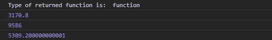
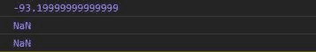

# D3.js 插值成员()函数

> 原文:[https://www . geeksforgeeks . org/D3-js-interprenenumber-function/](https://www.geeksforgeeks.org/d3-js-interpolatenumber-function/)

**d3 .插值数字()**函数用于返回两个给定数字之间的插值。它与 d3.interpolate()函数几乎相同，只是它只接受数字作为参数。

**语法:**

```
d3.interpolateNumber(a,b);

```

**参数:**该函数接受两个参数，如上所述，如下所述。

*   **a:** 是数字线上的任意数字。
*   **b:** 是数字线上的任意数字。

**返回值:**该函数返回两个给定数字之间的插值器。

下面给出了 d3 .插值成员()函数的几个例子

**例 1:**

## 超文本标记语言

```
<!DOCTYPE html>
<html lang="en">
<head>
  <meta charset="UTF-8">
  <meta name="viewport" 
        content="width=device-width, initial-scale=1.0">
  <title>D3.js d3.interpolateNumber() Function</title>
</head>
<style>
</style>
<body>
  <!--Fetching from CDN of D3.js -->
  <script type = "text/javascript" src = 
"https://d3js.org/d3.v4.min.js">
  </script>
  <script>
    let intr = d3.interpolateNumber(2458,9586)
    console.log("Type of returned function is: ",typeof(intr));
    console.log(intr(0.1))
    console.log(intr(1))
    console.log(intr(0.4))
  </script>
</body>
</html>
```

**输出:**



**例 2:** 当给定的数为负数且其中一个不是数时。

## 超文本标记语言

```
<!DOCTYPE html>
<html lang="en">
<head>
  <meta charset="UTF-8">
  <meta name="viewport" 
        content="width=device-width, initial-scale=1.0">
  <title>D3.js d3.interpolateNumber() Function</title>
</head>
<style>
</style>
<body>
  <!--Fetching from CDN of D3.js -->
  <script type = "text/javascript" src = 
"https://d3js.org/d3.v4.min.js">
  </script>
  <script>
    console.log(d3.interpolateNumber(-263,586)(0.2))
    console.log(d3.interpolateNumber(-263,"green")(0.1))
    console.log(d3.interpolateNumber("yellow","red")(0.1))
  </script>
</body>
</html>
```

**输出:**

