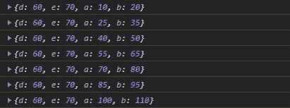
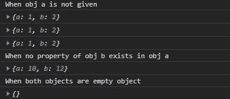

# D3.js 插值对象()函数

> 原文:[https://www . geesforgeks . org/D3-js-插值对象-函数/](https://www.geeksforgeeks.org/d3-js-interpolateobject-function/)

D3.js 中的**插值对象()**函数用于返回给定两个对象之间的插值函数。如果“a”中存在“b”的任何属性，则使用插值为“a”和“b”创建通用插值器。

**语法:**

```
d3.interpolateObject(a, b);
```

**参数:**下面给出两个参数:

*   **a:** 是 Javascript 对象。
*   **b:** 也是 Javascript 对象。

**返回:**返回两个对象的插值函数。

下面给出了上述函数的几个例子。

**例 1:**

```
<!DOCTYPE html>
<html lang="en">
<head>
  <meta charset="UTF-8">
  <meta name="viewport" 
        content="width=device-width, 
                 initial-scale=1.0">
  <title>Document</title>
</head>
<style>
</style>
<body>
  <!--Fetching from CDN of D3.js -->
  <script type = "text/javascript" 
          src = "https://d3js.org/d3.v4.min.js">
   </script>
  <script>
    let obj1={
      "a": 10,
      "b": 20,
      "c": 30
    } 
    let obj2={
      "a": 40,
      "b": 50,
      "d": 60,
      "e": 70
    } 
    let interpolationFunction=
d3.interpolateObject(obj1, obj2);
    /* Note the property d and e will not change
       as they are not present in obj1*/
    console.log(interpolationFunction(0))
    console.log(interpolationFunction(0.5))
    console.log(interpolationFunction(1))
    console.log(interpolationFunction(1.5))
    console.log(interpolationFunction(2))
    console.log(interpolationFunction(2.5))
    console.log(interpolationFunction(3))
  </script>
</body>
</html>
```

**输出:**



**例 2:**

```
<!DOCTYPE html>
<html lang="en">
<head>
  <meta charset="UTF-8">
  <meta name="viewport" 
        content="width=device-width, 
                 initial-scale=1.0">
  <title>Document</title>
</head>
<style>
</style>
<body>
  <!--Fetching from CDN of D3.js -->
  <script type = "text/javascript" 
          src = "https://d3js.org/d3.v4.min.js">
  </script>
  <script>
    console.log("When obj a is not given")
    console.log(d3.interpolateObject({}, {"a":1, "b":2})(0.5))
    console.log(d3.interpolateObject({}, {"a":1, "b":2})(1))
    console.log(d3.interpolateObject({}, {"a":1, "b":2})(2))
    console.log("When no property of obj b exists in obj a")
    console.log(
d3.interpolateObject({"c":4, "d":3}, {"a":10, "b":12})(5))
    console.log("When both objects are empty object")
    console.log(d3.interpolateObject({}, {})(5))

 </script>
</body>
</html>
```

**输出:**

