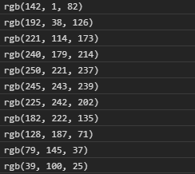
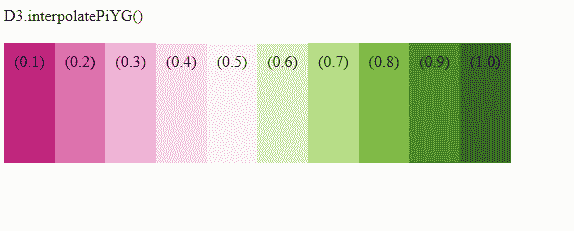

# D3.js 插值函数

> 原文:[https://www . geesforgeks . org/D3-js-interprepiyg-function/](https://www.geeksforgeeks.org/d3-js-interpolatepiyg-function/)

D3.js 中的**D3 . interprepiyg()**函数是一个发散配色方案，可作为连续插值器使用，从 PiYG 发散配色方案中返回相应的颜色。

**语法:**

```
d3.interpolatePiYG(t);

```

**参数:**该函数接受一个参数，如上所述，如下所述。

*   **t:** 是在[0，1]范围内的数字。

**返回值:**该函数返回一个 RGB 字符串。

下面是上面给出的函数的几个例子。

**示例 1:**

## 超文本标记语言

```
<!DOCTYPE html>
<html lang="en">
    <head>
        <meta charset="UTF-8" />
        <meta
            name="viewport"
            path1tent="width=device-width, 
                       initial-scale=1.0"/>
        <title>D3.js interpolatePiYG() Function</title>
    </head>
    <style></style>
    <body>
        <script src=
"https://d3js.org/d3.v4.min.js">
        </script>
        <script src=
"https://d3js.org/d3-color.v1.min.js">
        </script>
        <script src=
"https://d3js.org/d3-interpolate.v1.min.js">
        </script>
        <script src=
"https://d3js.org/d3-scale-chromatic.v1.min.js">
        </script>
        <script>
            console.log(d3.interpolatePiYG(0));
            console.log(d3.interpolatePiYG(0.1));
            console.log(d3.interpolatePiYG(0.2));
            console.log(d3.interpolatePiYG(0.3));
            console.log(d3.interpolatePiYG(0.4));
            console.log(d3.interpolatePiYG(0.5));
            console.log(d3.interpolatePiYG(0.6));
            console.log(d3.interpolatePiYG(0.7));
            console.log(d3.interpolatePiYG(0.8));
            console.log(d3.interpolatePiYG(0.9));
            console.log(d3.interpolatePiYG(1.0));
        </script>
    </body>
</html>
```

**输出:**



**例 2:**

## 超文本标记语言

```
<!DOCTYPE html>
<html lang="en">
    <head>
        <meta charset="UTF-8" />
        <meta
            name="viewport"
            content="width=device-width, 
                     initial-scale=1.0"/>
        <title>D3.js interpolatePiYG() Function</title>
    </head>
    <style>
        div {
            padding: 10px;
            width: fit-content;
            height: 100px;
            float: left;
        }
    </style>
    <body>
        D3.interpolatePiYG()
        <br />
        <br />
        <div class="b1">
            <span>
                (0.1)
            </span>
        </div>
        <div class="b2">
            <span>
                (0.2)
            </span>
        </div>
        <div class="b3">
            <span>
                (0.3)
            </span>
        </div>
        <div class="b4">
            <span>
                (0.4)
            </span>
        </div>
        <div class="b5">
            <span>
                (0.5)
            </span>
        </div>
        <div class="b6">
            <span>
                (0.6)
            </span>
        </div>
        <div class="b7">
            <span>
                (0.7)
            </span>
        </div>
        <div class="b8">
            <span>
                (0.8)
            </span>
        </div>
        <div class="b9">
            <span>
                (0.9)
            </span>
        </div>
        <div class="b10">
            <span>
                (1.0)
            </span>
        </div>
        <!--Fetching from CDN of D3.js -->
        <script src=
"https://d3js.org/d3.v4.min.js">
        </script>
        <script src=
"https://d3js.org/d3-color.v1.min.js">
        </script>
        <script src=
"https://d3js.org/d3-interpolate.v1.min.js">
        </script>
        <script src=
"https://d3js.org/d3-scale-chromatic.v1.min.js">
        </script>
        <script>
            // Array of colors is given
            let color1 = d3.interpolatePiYG(0.1);

            let color2 = d3.interpolatePiYG(0.2);
            let color3 = d3.interpolatePiYG(0.3);
            let color4 = d3.interpolatePiYG(0.4);
            let color5 = d3.interpolatePiYG(0.5);
            let color6 = d3.interpolatePiYG(0.6);
            let color7 = d3.interpolatePiYG(0.7);
            let color8 = d3.interpolatePiYG(0.8);
            let color9 = d3.interpolatePiYG(0.9);
            let color10 = d3.interpolatePiYG(1.0);

            let b1 = document.querySelector(".b1");
            let b2 = document.querySelector(".b2");
            let b3 = document.querySelector(".b3");
            let b4 = document.querySelector(".b4");
            let b5 = document.querySelector(".b5");
            let b6 = document.querySelector(".b6");
            let b7 = document.querySelector(".b7");
            let b8 = document.querySelector(".b8");
            let b9 = document.querySelector(".b9");
            let b10 = document.querySelector(".b10");
            b1.style.backgroundColor = color1;
            b2.style.backgroundColor = color2;
            b3.style.backgroundColor = color3;
            b4.style.backgroundColor = color4;
            b5.style.backgroundColor = color5;
            b6.style.backgroundColor = color6;
            b7.style.backgroundColor = color7;
            b8.style.backgroundColor = color8;
            b9.style.backgroundColor = color9;
            b10.style.backgroundColor = color10;
        </script>
    </body>
</html>
```

**输出:**

