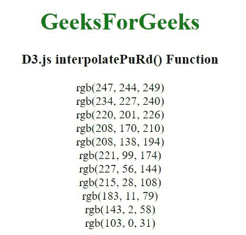

# D3.js 插值 uRd()函数

> 原文:[https://www . geesforgeks . org/D3-js-interprepurd-function/](https://www.geeksforgeeks.org/d3-js-interpolatepurd-function/)

D3.js 中的**D3 . interprepurd()**函数用于从“PuRd”顺序配色方案中返回特定的颜色，该配色方案以 RGB 字符串的形式返回。

**语法:**

```
d3.interpolatePuRd(t)
```

**参数:**该函数接受如上所述的单个参数，如下所述:

*   **t:**“t”是一个在[0，1]范围内的数字。

**返回值:**返回一个 RGB 字符串。

**例 1:**

## 超文本标记语言

```
<!DOCTYPE html>
<html lang="en">

<head>
    <meta charset="UTF-8" />
    <meta name="viewport" path1tent="width=device-width,  
        initial-scale=1.0" />

    <title>D3.js interpolatePuRd() Function</title>
    <script src=
        "https://d3js.org/d3.v4.min.js">
    </script>
    <script src=
"https://d3js.org/d3-color.v1.min.js">
    </script>
    <script src=
"https://d3js.org/d3-interpolate.v1.min.js">
    </script>
    <script src=
"https://d3js.org/d3-scale-chromatic.v1.min.js">
    </script>
</head>

<body>
    <center>
        <h1 style="color:green;">GeeksForGeeks</h1>

        <h3>D3.js interpolatePuRd() Function</h3>

        <script>
            document.write(d3.interpolatePuRd(0) + "<br>");
            document.write(d3.interpolatePuRd(0.1) + "<br>");
            document.write(d3.interpolatePuRd(0.2) + "<br>");
            document.write(d3.interpolatePuRd(0.3) + "<br>");
            document.write(d3.interpolatePuRd(0.4) + "<br>");
            document.write(d3.interpolatePuRd(0.5) + "<br>");
            document.write(d3.interpolatePuRd(0.6) + "<br>");
            document.write(d3.interpolatePuRd(0.7) + "<br>");
            document.write(d3.interpolatePuRd(0.8) + "<br>");
            document.write(d3.interpolatePuRd(0.9) + "<br>");
            document.write(d3.interpolatePuRd(1));
        </script>
    </center>
</body>

</html>
```

**输出:**



**例 2:**

## 超文本标记语言

```
<!DOCTYPE html>
<html lang="en">

<head>
    <meta charset="UTF-8" />
    <meta name="viewport" path1tent="width=device-width,  
        initial-scale=1.0" />

    <title>D3.js interpolatePuRd() Function</title>
    <script src=
        "https://d3js.org/d3.v4.min.js">
    </script>
    <script src=
"https://d3js.org/d3-color.v1.min.js">
    </script>
    <script src=
"https://d3js.org/d3-interpolate.v1.min.js">
    </script>
    <script src=
"https://d3js.org/d3-scale-chromatic.v1.min.js">
    </script>

    <style> 
        div { 
            padding: 3px; 
            width: fit-content; 
            height: 20px;
            width: 250px;
        } 
    </style> 
</head>

<body>
    <center>
        <h1 style="color:green;">GeeksForGeeks</h1>

        <h3>D3.js interpolatePuRd() Function</h3>

        <div class="b1"> 
            <span> 
                D3.interpolatePuRd(0) 
            </span> 
        </div> 
        <div class="b2"> 
            <span> 
                D3.interpolatePuRd(0.1)  
            </span> 
        </div> 
        <div class="b3"> 
            <span> 
                D3.interpolatePuRd(0.2)
            </span> 
        </div> 
        <div class="b4"> 
            <span> 
                D3.interpolatePuRd(0.3)  
            </span> 
        </div> 
        <div class="b5"> 
            <span> 
                D3.interpolatePuRd(0.4) 
            </span> 
        </div> 
        <div class="b6"> 
            <span> 
                D3.interpolatePuRd(0.5)  
            </span> 
        </div> 
        <div class="b7"> 
            <span> 
                D3.interpolatePuRd(0.6)  
            </span> 
        </div> 
        <div class="b8"> 
            <span> 
                D3.interpolatePuRd(0.7) 
            </span> 
        </div> 
        <div class="b9"> 
            <span> 
                D3.interpolatePuRd(0.8)  
            </span> 
        </div> 
        <div class="b10"> 
            <span> 
                D3.interpolatePuRd(0.9)  
            </span> 
        </div> 
        <div class="b11"> 
            <span> 
                D3.interpolatePuRd(1)  
            </span> 
        </div> 
        <script> 
            // Array of colors is given 
            let color1 = d3.interpolatePuRd(0.0); 
            let color2 = d3.interpolatePuRd(0.1); 
            let color3 = d3.interpolatePuRd(0.2); 
            let color4 = d3.interpolatePuRd(0.3); 
            let color5 = d3.interpolatePuRd(0.4); 
            let color6 = d3.interpolatePuRd(0.5);
            let color7 = d3.interpolatePuRd(0.6); 
            let color8 = d3.interpolatePuRd(0.7); 
            let color9 = d3.interpolatePuRd(0.8); 
            let color10 = d3.interpolatePuRd(0.9); 
            let color11 = d3.interpolatePuRd(1.0); 

            let b1 = document.querySelector(".b1"); 
            let b2 = document.querySelector(".b2"); 
            let b3 = document.querySelector(".b3"); 
            let b4 = document.querySelector(".b4"); 
            let b5 = document.querySelector(".b5"); 
            let b6 = document.querySelector(".b6"); 
            let b7 = document.querySelector(".b7"); 
            let b8 = document.querySelector(".b8"); 
            let b9 = document.querySelector(".b9"); 
            let b10 = document.querySelector(".b10"); 
            let b11 = document.querySelector(".b11"); 

            b1.style.backgroundColor = color1; 
            b2.style.backgroundColor = color2;
            b3.style.backgroundColor = color3; 
            b4.style.backgroundColor = color4;
            b5.style.backgroundColor = color5; 
            b6.style.backgroundColor = color6;
            b7.style.backgroundColor = color7;
            b8.style.backgroundColor = color8; 
            b9.style.backgroundColor = color9;
            b10.style.backgroundColor = color10; 
            b11.style.backgroundColor = color11;
        </script>
    </center>
</body>

</html>
```

**输出:**

