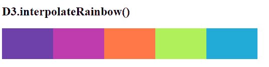

# D3.js 插值函数

> 原文:[https://www . geesforgeks . org/D3-js-interpreferinbow-function/](https://www.geeksforgeeks.org/d3-js-interpolaterainbow-function/)

函数的作用是:返回一串 RGB 颜色，对应于 0 到 0.5 范围内的 d3 .插值颜色和 0.5 到 1.0 范围内的 d3 .插值颜色。因此，它在 d3.js 中形成了循环的不太生气的彩虹配色方案。

**语法:**

```
d3.interpolateRainbow(t);
```

**参数:**该功能接受如上所述的单个参数，描述如下:

*   **t:** 是一个范围在[0，1]的数值。

**返回值:**该函数返回一串 RGB 颜色。

下面是上面给出的函数的几个例子。

**例 1:**

## 超文本标记语言

```
<!DOCTYPE html>
<html lang="en">

<head>
    <meta charset="UTF-8">
    <meta name="viewport" content=
        "width=device-width, initial-scale=1.0">

    <!--Fetching from CDN of D3.js -->
    <script src="https://d3js.org/d3.v4.min.js">
    </script>
    <script src=
        "https://d3js.org/d3-color.v1.min.js">
    </script>
    <script src=
        "https://d3js.org/d3-interpolate.v1.min.js">
    </script>
    <script src=
        "https://d3js.org/d3- scale-chromatic.v1.min.js">
    </script>
</head>

<body>
    <script>
        console.log(d3.interpolateRainbow(0.4));
        console.log(d3.interpolateRainbow(0.3));
        console.log(d3.interpolateRainbow(0.2));
        console.log(d3.interpolateRainbow(0.5));
        console.log(d3.interpolateRainbow(0.4));
        console.log(d3.interpolateRainbow(0.9));
        console.log(d3.interpolateRainbow(0.2));
        console.log(d3.interpolateRainbow(0));
    </script>
</body>

</html>
```

**输出:**

```
rgb(226, 183, 47)
rgb(255, 120, 71)
rgb(254, 75, 131)
rgb(175, 240, 91)
rgb(226, 183, 47)
rgb(76, 110, 219)
rgb(254, 75, 131)
rgb(110, 64, 170)
```

**例 2:**

## 超文本标记语言

```
<!DOCTYPE html>
<html lang="en">

<head>
    <meta charset="UTF-8">
    <meta name="viewport" content=
        "width=device-width, initial-scale=1.0">

    <style>
        div {
            padding: 6px;
            text-align: center;
            vertical-align: middle;
            display: flex;
            justify-content: center;
            width: 90px;
            height: 50px;
            float: left;
        }
    </style>

    <!--Fetching from CDN of D3.js -->
    <script src="https://d3js.org/d3.v4.min.js">
    </script>
    <script src="https://d3js.org/d3-color.v1.min.js">
    </script>
    <script src=
        "https://d3js.org/d3-interpolate.v1.min.js">
    </script>
    <script src=
        "https://d3js.org/d3-scale-chromatic.v1.min.js">
    </script>
</head>

<body>
    <h2>D3.interpolateRainbow() </h2>
    <div class="box1">
        <span></span>
    </div>
    <div class="box2">
        <span></span>
    </div>
    <div class="box3">
        <span></span>
    </div>
    <div class="box4">
        <span></span>
    </div>
    <div class="box5">
        <span></span>
    </div>

    <script>

        // Creating different colors for
        // different Values of t is 0
        let color1 =
            d3.interpolateRainbow(0);

        // Values of t is 0.1
        let color2 =
            d3.interpolateRainbow(0.1);

        // Values of t is 0.3
        let color3 =
            d3.interpolateRainbow(0.3);

        // Values of t is 0.5
        let color4 =
            d3.interpolateRainbow(0.5);

        // Values of t is 0.8
        let color5 =
            d3.interpolateRainbow(0.8);

        // Selecting Div using query selector
        let box1 = document.querySelector(".box1");
        let box2 = document.querySelector(".box2");
        let box3 = document.querySelector(".box3");
        let box4 = document.querySelector(".box4");
        let box5 = document.querySelector(".box5");

        // Setting style and BG color of 
        // the particular DIVs
        box1.style.backgroundColor = color1;
        box2.style.backgroundColor = color2;
        box3.style.backgroundColor = color3;
        box4.style.backgroundColor = color4;
        box5.style.backgroundColor = color5; 
    </script>
</body>

</html>
```

**输出:**

