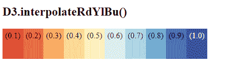

# D3.js 插值 eRdYlBu()函数

> 原文:[https://www . geesforgeks . org/D3-js-interprederylbu-function/](https://www.geeksforgeeks.org/d3-js-interpolaterdylbu-function/)

D3.js 中的 **d3 .插值 eRdYlBu()** 函数用于从 RdYlBu 的发散配色方案中返回相应的颜色，其中 Rd 为红色，Yl 为黄色，Bu 为蓝色。

**语法:**

```
d3.interpolateRdYlBu(t);

```

**参数:**该函数接受如上所述的单个参数，如下所述:

*   **t:** 是 0 到 1 范围内的任意数字。

**返回值:**返回一个 RGB 字符串。

下面的例子说明了 JavaScript 中的 D3.js 插值器(插值器)函数:

**示例 1:**

## 超文本标记语言

```
<!DOCTYPE html>
<html lang="en">
    <head>
        <meta charset="UTF-8" />
        <meta
            name="viewport"
            content="width=device-width, 
                     initial-scale=1.0"/>
        <title>D3.js interpolateRdYlBu() Function</title>
    </head>
    <style></style>
    <body>
        <!--Fetching from CDN of D3.js -->
        <script src=
"https://d3js.org/d3.v4.min.js">
        </script>
        <script src=
"https://d3js.org/d3-color.v1.min.js">
        </script>
        <script src=
"https://d3js.org/d3-interpolate.v1.min.js">
        </script>
        <script src=
"https://d3js.org/d3-scale-chromatic.v1.min.js">
        </script>
        <script>
            console.log(d3.interpolateRdYlBu(0));
            console.log(d3.interpolateRdYlBu(0.124));
            console.log(d3.interpolateRdYlBu(0.241));
            console.log(d3.interpolateRdYlBu(0.3254));
            console.log(d3.interpolateRdYlBu(0.4125));
            console.log(d3.interpolateRdYlBu(0.512));
            console.log(d3.interpolateRdYlBu(0.6142));
            console.log(d3.interpolateRdYlBu(0.7124));
            console.log(d3.interpolateRdYlBu(0.8452));
            console.log(d3.interpolateRdYlBu(0.9412));
            console.log(d3.interpolateRdYlBu(1.0));
        </script>
    </body>
</html>
```

**输出:**


**例 2:**

## 超文本标记语言

```
<!DOCTYPE html>
<html lang="en">
    <head>
        <meta charset="UTF-8" />
        <meta
            name="viewport"
            content="width=device-width, 
                     initial-scale=1.0"/>
        <title>D3.js interpolateRdYlBu() Function</title>
    </head>
    <style>
        div {
            padding: 5px;
            text-align: center;
            vertical-align: middle;
            display: flex;
            justify-content: center;
            width: fit-content;
            height: 50px;
            float: left;
        }
    </style>
    <body>
        <h2>D3.interpolateRdYlBu()</h2>
        <div class="box1">
            <span>
                (0.1)
            </span>
        </div>
        <div class="box2">
            <span>
                (0.2)
            </span>
        </div>
        <div class="box3">
            <span>
                (0.3)
            </span>
        </div>
        <div class="box4">
            <span>
                (0.4)
            </span>
        </div>
        <div class="box5">
            <span>
                (0.5)
            </span>
        </div>
        <div class="b6">
            <span>
                (0.6)
            </span>
        </div>
        <div class="b7">
            <span>
                (0.7)
            </span>
        </div>
        <div class="b8">
            <span>
                (0.8)
            </span>
        </div>
        <div class="b9">
            <span>
                (0.9)
            </span>
        </div>
        <div class="b10">
            <span style="color: honeydew;">
                (1.0)
            </span>
        </div>
        <!--Fetching from CDN of D3.js -->
        <script src=
"https://d3js.org/d3.v4.min.js">
        </script>
        <script src=
"https://d3js.org/d3-color.v1.min.js">
        </script>
        <script src=
"https://d3js.org/d3-interpolate.v1.min.js">
        </script>
        <script src=
"https://d3js.org/d3-scale-chromatic.v1.min.js">
        </script>
        <script>
            // Creating different colors for different
            // Values of t as 0.1,0.2... 1.0
            let color1 = d3.interpolateRdYlBu(0.1);
            let color2 = d3.interpolateRdYlBu(0.2);
            let color3 = d3.interpolateRdYlBu(0.3);
            let color4 = d3.interpolateRdYlBu(0.4);
            let color5 = d3.interpolateRdYlBu(0.5);
            let color6 = d3.interpolateRdYlBu(0.6);
            let color7 = d3.interpolateRdYlBu(0.7);
            let color8 = d3.interpolateRdYlBu(0.8);
            let color9 = d3.interpolateRdYlBu(0.9);
            let color10 = d3.interpolateRdYlBu(1.0);

            // Selecting Div using query selector
            let box1 = document.querySelector(".box1");
            let box2 = document.querySelector(".box2");
            let box3 = document.querySelector(".box3");
            let box4 = document.querySelector(".box4");
            let box5 = document.querySelector(".box5");
            let b6 = document.querySelector(".b6");
            let b7 = document.querySelector(".b7");
            let b8 = document.querySelector(".b8");
            let b9 = document.querySelector(".b9");
            let b10 = document.querySelector(".b10");

            // Setting style and BG color of the particular DIVs
            box1.style.backgroundColor = color1;
            box2.style.backgroundColor = color2;
            box3.style.backgroundColor = color3;
            box4.style.backgroundColor = color4;
            box5.style.backgroundColor = color5;
            b6.style.backgroundColor = color6;
            b7.style.backgroundColor = color7;
            b8.style.backgroundColor = color8;
            b9.style.backgroundColor = color9;
            b10.style.backgroundColor = color10;
        </script>
    </body>
</html>
```

**输出:**

