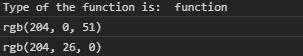
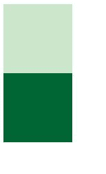

# D3.js 插值函数

> 原文:[https://www . geeksforgeeks . org/D3-js-插值器 b-function/](https://www.geeksforgeeks.org/d3-js-interpolatergb-function/)

**d3。插值器()**函数用于插值两种颜色，并使用可调的伽马值返回它们之间的插值器。

**语法:**

```
d3.interpolateRgb(a, b)
```

**参数:**取两个参数。

*   **a:** 是一种颜色。
*   **b:** 是一种颜色。

**返回:**返回插值函数。

下面给出了几个 d3 .插值函数的例子。

**例 1:** 在控制台打印颜色。

```
<!DOCTYPE html>
<html lang="en">
<head>
  <meta charset="UTF-8">
  <meta name="viewport" 
        content="width=device-width, 
                 initial-scale=1.0">
  <title>Document</title>
</head>
<style>
</style>
<body>
  <!--fetching from CDN of D3.js -->
  <script type = "text/javascript" 
          src =
 "https://d3js.org/d3.v4.min.js">
   </script>
  <script>
    console.log("Type of the function is: ",
 typeof(d3.interpolateRgb("Red", "blue")));
    console.log(d3.interpolateRgb("Red", "blue")(0.2));
    console.log(d3.interpolateRgb("Red", "green")(0.2))
  </script>
</body>
</html>
```

**输出:**



**示例 2:** 在 HTML 中显示颜色

```
<!DOCTYPE html>
<html lang="en">
<head>
  <meta charset="UTF-8">
  <meta name="viewport" 
        content="width=device-width,
                 initial-scale=1.0">
  <title>Document</title>
</head>
<style>
  .b1, .b2{
    width: 100px;
    height: 100px;
  }
</style>
<body>
  <div class="b1">

  </div>
  <div class="b2">

  </div>
  <!--fetching from CDN of D3.js -->
  <script type = "text/javascript"
          src = "https://d3js.org/d3.v4.min.js">
  </script>
  <script>
    let color=d3.interpolateRgb(
"white", "green")(0.2);
    let color2=d3.interpolateRgb(
"blue", "green")(0.8);
    let b1=document.querySelector(".b1");
    let b2=document.querySelector(".b2");
    b1.style.backgroundColor=color;
    b2.style.backgroundColor=color2;
  </script>
</body>
</html>
```

**输出:**

