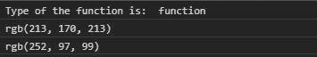
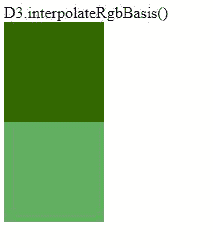

# D3.js 插值函数

> 原文:[https://www . geesforgeks . org/D3-js-interpregerbbbasis-function/](https://www.geeksforgeeks.org/d3-js-interpolatergbbasis-function/)

**d3。函数的作用是:返回一组颜色的均匀非有理 B 样条插值函数，这些颜色被转换成一种 RGB 颜色。**

**语法:**

```
d3.interpolateRgbBasis(colors);

```

**参数:**取一组颜色。

**返回:**返回插值函数。

下面给出了一些插值的例子。RgbBasis()函数。

**例 1:** 在控制台打印输出。

```
<!DOCTYPE html>
<html lang="en">
<head>
  <meta charset="UTF-8">
  <meta name="viewport" 
        content="width=device-width, 
                 initial-scale=1.0">
  <title>Document</title>
</head>
<style>
  .b1, .b2{
    width: 100px;
    height: 100px;
  }
</style>
<body>
  <div class="b1">

  </div>
  <div class="b2">

  </div>
  <!--Fetching from CDN of D3.js -->
  <script type = "text/javascript" 
          src = 
"https://d3js.org/d3.v4.min.js">
   </script>
  <script>
    console.log("Type of the function is: ",
 typeof(d3.interpolateRgbBasis(["red", "white", "blue"])))

    console.log(
d3.interpolateRgbBasis(["red", "white", "blue"])(0.5))

    console.log(
d3.interpolateRgbBasis(["red", "white", "blue"])(0.2))
  </script>
</body>
</html>
```

**输出:**



**示例 2:** 在 HTML 中使用 d3 .插值器基础。

```
<!DOCTYPE html>
<html lang="en">
<head>
  <meta charset="UTF-8">
  <meta name="viewport" 
        content="width=device-width, 
                 initial-scale=1.0">
  <title>Document</title>
</head>
<style>
  div{
    width: 100px;
    height: 100px;
  }
</style>
<body>
  D3.interpolateRgbBasis()
  <div class="b1">
  </div>
  <div class="b2">
  </div>
  <!--Fetching from CDN of D3.js -->
  <script type = "text/javascript"
          src = 
"https://d3js.org/d3.v4.min.js">
   </script>
  <script>
    // Array of colors is given
    let color=
d3.interpolateRgbBasis([ "white", "red", "green"])(0.9);

    let color2=
d3.interpolateRgbBasis(["red", "white", "green"])(0.8);

    let b1=document.querySelector(".b1");
    let b2=document.querySelector(".b2");
    b1.style.backgroundColor=color;
    b2.style.backgroundColor=color2;
  </script>
</body>
</html>
```

**输出:**

