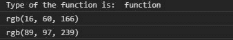
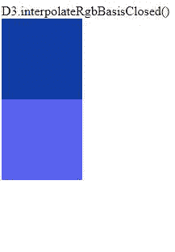

# D3.js 插值函数

> 原文:[https://www . geeksforgeeks . org/D3-js-interpregerbbbasisposed-function/](https://www.geeksforgeeks.org/d3-js-interpolatergbbasisclosed-function/)

D3.js 中的 **d3 .插值器 BasisClosed()** 函数用于通过包含颜色串的数组输入返回均匀非有理 B-脊椎插值器。

**语法:**

```
d3.interpolateRgbBasisClosed(values);

```

**参数:**该函数接受如上所述的单个参数，如下所述:

*   **值:**是颜色串的数组。

**返回值:**返回一个 RGB 颜色。

下面给出了上述函数的几个例子。

**例 1:**

## 超文本标记语言

```
<!DOCTYPE html> 
<html lang="en"> 
<head> 
  <meta charset="UTF-8"> 
  <meta name="viewport" 
        content="width=device-width,  
                 initial-scale=1.0"> 
  <title>Document</title> 
</head> 
<style> 
</style> 
<body> 
  <div class="b1"> 

  </div> 
  <div class="b2"> 

  </div> 
  <!--Fetching from CDN of D3.js -->
  <script type = "text/javascript" 
          src =  
"https://d3js.org/d3.v4.min.js"> 
   </script> 
  <script> 
    console.log("Type of the function is: ", 
typeof(d3.interpolateRgbBasisClosed(["red"]))) 

    console.log( 
d3.interpolateRgbBasisClosed(["blue", "white", "green"])(0.9)) 

    console.log( 
d3.interpolateRgbBasisClosed(["blue", "white", "green"])(0.1)) 
  </script> 
</body> 
</html>
```

**输出:**



**例 2:**

## 超文本标记语言

```
<!DOCTYPE html> 
<html lang="en"> 
<head> 
  <meta charset="UTF-8"> 
  <meta name="viewport" 
        content="width=device-width,  
                 initial-scale=1.0"> 
  <title>Document</title> 
</head> 
<style> 
  .bx1,.bx2{ 
    width: 100px; 
    height: 100px; 
  } 
</style> 
<body> 
  D3.interpolateRgbBasisClosed() 
  <div class="bx1"> 
  </div> 
  <div class="bx2"> 
  </div> 
  <!--Fetching from CDN of D3.js -->
  <script type = "text/javascript"
          src =  
"https://d3js.org/d3.v4.min.js"> 
   </script> 
  <script> 
    // Array of colors is given 
    let color= 
d3.interpolateRgbBasisClosed(["blue", "white", "green"])(0.9);
    let color2= 
d3.interpolateRgbBasisClosed(["blue", "white", "green"])(0.1)
    let bx1=document.querySelector(".bx1"); 
    let bx2=document.querySelector(".bx2"); 
    bx1.style.backgroundColor=color; 
    bx2.style.backgroundColor=color2; 
  </script> 
</body> 
</html>
```

**输出:**

