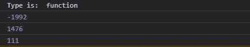

# D3.js 插值函数

> 原文:[https://www . geeksforgeeks . org/D3-js-interpreferoud-function/](https://www.geeksforgeeks.org/d3-js-interpolateround-function/)

**d3。插值函数()**函数用于返回两个给定数字的插值，并将它们舍入到最接近的整数。

**语法:**

```
d3.interpolateRound(a,b)

```

**参数:**该功能接受两个参数，如上所述，描述如下。

*   **a:** 任意数字。
*   **b:** 任意数字。

**返回值:**返回插值函数。

下面给出了一些插值的例子。Round()函数。

**例 1:**

## 超文本标记语言

```
<!DOCTYPE html>
<html lang="en">
<head>
  <meta charset="UTF-8">
  <meta name="viewport" 
        content="width=device-width, initial-scale=1.0">
  <title>D3.js d3.interpolateRound() Function</title>
</head>
<style>
</style>
<body>
  <!--Fetching from CDN of D3.js -->
  <script type = "text/javascript" src = 
"https://d3js.org/d3.v4.min.js">
  </script>
  <script>
    console.log("Type is: ",typeof(d3.interpolateRound(4,5)))
    console.log(d3.interpolateRound(-2636,586)(0.2))
    console.log(d3.interpolateRound(3545,96.485)(0.6))
    console.log(d3.interpolateRound(24.1545,458)(0.2))
  </script>
</body>
</html>
```

**输出:**



**例 2:** 当传递数字以外的任何东西时。

## 超文本标记语言

```
<!DOCTYPE html>
<html lang="en">
<head>
  <meta charset="UTF-8">
  <meta name="viewport" 
        content="width=device-width, initial-scale=1.0">
  <title>D3.js d3.interpolateRound() Function</title>
</head>
<style>
</style>
<body>
  <!--Fetching from CDN of D3.js -->
  <script type = "text/javascript" src = 
"https://d3js.org/d3.v4.min.js">
  </script>
  <script>
    console.log("Type is: ",typeof(d3.interpolateRound(4,5)))
    console.log(d3.interpolateRound([1,2,3],[2,3,4])(0.2))
    console.log(d3.interpolateRound(3545,"green")(0.6))
    console.log(d3.interpolateRound("green","red")(0.2))
    console.log(d3.interpolateRound(245889,)(0.2))
  </script>
</body>
</html>
```

**输出:**

