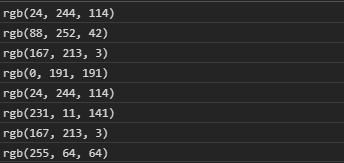
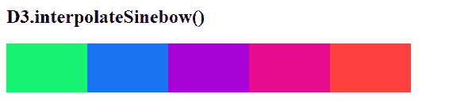

# D3.js 插值插值(函数)

> 原文:[https://www . geeksforgeeks . org/D3-js-interpolesinenbow-function/](https://www.geeksforgeeks.org/d3-js-interpolatesinebow-function/)

**d3 .插值 nbow()** 功能是由**吉姆·本加德纳**和**查理·洛德**引入的正弦曲线配色方案的一部分。该函数用于返回对应于 Sinebow 配色方案的 RGB 颜色字符串。

**语法:**

```
d3.interpolateSinebow(t);
```

**参数:**该功能接受如上所述的单个参数，描述如下:

*   **t:** 是一个数值，范围包括[0，1]。

**返回值:**上面给定的函数返回一个 RGB 字符串。

下面是上面给出的函数的几个例子。

**例 1:**

## 超文本标记语言

```
<!DOCTYPE html>
<html lang="en">

<head>
    <meta charset="UTF-8">
    <meta name="viewport" content=
        "width=device-width,initial-scale=1.0">

    <!--Fetching from CDN of D3.js -->
    <script src="https://d3js.org/d3.v4.min.js">
    </script>
    <script src="https://d3js.org/d3-color.v1.min.js">
    </script>
    <script src=
        "https://d3js.org/d3-interpolate.v1.min.js">
    </script>
    <script src=
        "https://d3js.org/d3-scale-chromatic.v1.min.js">
    </script>
</head>

<body>
    <script>
        console.log(d3.interpolateSinebow(0.4));
        console.log(d3.interpolateSinebow(0.3));
        console.log(d3.interpolateSinebow(0.2));
        console.log(d3.interpolateSinebow(0.5));
        console.log(d3.interpolateSinebow(0.4));
        console.log(d3.interpolateSinebow(0.9));
        console.log(d3.interpolateSinebow(0.2));
        console.log(d3.interpolateSinebow(0));
    </script>
</body>

</html>
```

**输出:**



**例 2:**

## 超文本标记语言

```
<!DOCTYPE html>
<html lang="en">

<head>
    <meta charset="UTF-8">
    <meta name="viewport" content=
        "width=device-width,initial-scale=1.0">

    <style>
        div {
            padding: 6px;
            text-align: center;
            vertical-align: middle;
            display: flex;
            justify-content: center;
            width: 90px;
            height: 50px;
            float: left;
        }
    </style>

    <!--Fetching from CDN of D3.js -->
    <script src="https://d3js.org/d3.v4.min.js">
    </script>
    <script src="https://d3js.org/d3-color.v1.min.js">
    </script>
    <script src=
        "https://d3js.org/d3-interpolate.v1.min.js">
    </script>
    <script src=
        "https://d3js.org/d3-scale-chromatic.v1.min.js">
    </script>
</head>

<body>
    <h2>D3.interpolateSinebow() </h2>

    <div class="pixel1">
        <span></span>
    </div>
    <div class="pixel2">
        <span></span>
    </div>
    <div class="pixel3">
        <span></span>
    </div>
    <div class="pixel4">
        <span></span>
    </div>
    <div class="pixel5">
        <span></span>
    </div>

    <script>
        // Creating different colors for
        // different
        // Values of t is 0.4
        let color1 =
            d3.interpolateSinebow(0.4);
        // Values of t is 0.6
        let color2 =
            d3.interpolateSinebow(0.6);
        // Values of t is 0.8
        let color3 =
            d3.interpolateSinebow(0.8);
        // Values of t is 0.9
        let color4 =
            d3.interpolateSinebow(0.9);
        // Values of t is 0
        let color5 =
            d3.interpolateSinebow(0);

        // Selecting Div using query selector
        let pixel1 = document.querySelector(".pixel1");
        let pixel2 = document.querySelector(".pixel2");
        let pixel3 = document.querySelector(".pixel3");
        let pixel4 = document.querySelector(".pixel4");
        let pixel5 = document.querySelector(".pixel5");

        // Setting style and BG color of the
        // particular DIVs
        pixel1.style.backgroundColor = color1;
        pixel2.style.backgroundColor = color2;
        pixel3.style.backgroundColor = color3;
        pixel4.style.backgroundColor = color4;
        pixel5.style.backgroundColor = color5; 
    </script>
</body>

</html>
```

**输出:**

