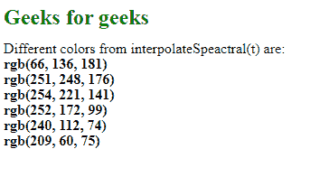
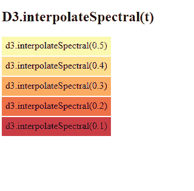

# D3.js 插值 Spectral()函数

> 原文:[https://www . geesforgeks . org/D3-js-interprespectral-function/](https://www.geeksforgeeks.org/d3-js-interpolatespectral-function/)

**d3 .插值 Spectral()** 函数用于从“光谱”发散配色方案中返回颜色。此函数返回的颜色是 RGB 字符串的形式。

**语法:**

```
d3.interpolateSpectral(t);
```

**参数:**该函数只取一个参数，如上所述，如下所述。

*   **t:** 该参数取一个介于 0 到 1 之间的数字。

**返回值:**该函数返回一个 RGB 字符串。

下面是上面给出的函数的几个例子。

**示例 1:**

```
<!DOCTYPE html> 
<html lang="en"> 
<head> 
    <meta charset="UTF-8" /> 
    <meta name="viewport"
        path1tent="width=device-width, 
        initial-scale=1.0"/> 
    <title>Geeks for geeks</title> 
    <script src=
    "https://d3js.org/d3.v4.min.js">
    </script> 
    <script src=
    "https://d3js.org/d3-color.v1.min.js">
    </script> 
    <script src=
    "https://d3js.org/d3-interpolate.v1.min.js">
    </script> 
    <script src=
    "https://d3js.org/d3-scale-chromatic.v1.min.js">
    </script> 
</head> 
<style>
    h2{
        color: green;
    }
    p{
        line-height: 1px;
    }
</style>
<body> 
    <h2>Geeks for geeks</h2>
    <p>Different colors from interpolateSpeactral(t) are: </p>
    <script> 
        document.write(
"<p><b>"+d3.interpolateSpectral(0.9)+"</p></b>");  
        document.write(
"<p><b>"+d3.interpolateSpectral(0.5)+"</p></b>"); 
        document.write(
"<p><b>"+d3.interpolateSpectral(0.4)+"</p></b>"); 
        document.write(
"<p><b>"+d3.interpolateSpectral(0.3)+"</p></b>"); 
        document.write(
"<p><b>"+d3.interpolateSpectral(0.2)+"</p></b>"); 
        document.write(
"<p><b>"+d3.interpolateSpectral(0.1)+"</p></b>"); 
    </script> 
</body> 
</html>
```

**输出:**



**例 2:**

```
<!DOCTYPE html> 
<html lang="en"> 
<head> 
<meta charset="UTF-8"> 
<meta name="viewport"
        content="width=device-width, 
                initial-scale=1.0"> 
<title>Document</title> 
</head> 
<style> 
div{ 
  padding:6px;
  text-align: center;
  vertical-align: middle;
  display: flex;
  justify-content: center;
  width: fit-content;
  margin-top: 2px;
  height: 20px; 
} 
</style> 
<body> 
  <h2>D3.interpolateSpectral(t) </h2>
<div class="box1"> 
  <span>d3.interpolateSpectral(0.5)</span>
</div> 
<div class="box2"> 
  <span>d3.interpolateSpectral(0.4)</span>
</div>
<div class="box3"> 
  <span>d3.interpolateSpectral(0.3)</span>
</div>
<div class="box4"> 
  <span>d3.interpolateSpectral(0.2)</span>
</div>
<div class="box5"> 
  <span>d3.interpolateSpectral(0.1)</span>
</div>
<!--Fetching from CDN of D3.js -->
  <script src = 
  "https://d3js.org/d3.v4.min.js"> 
  </script> 
  <script src=
  "https://d3js.org/d3-color.v1.min.js">
  </script>
  <script src=
  "https://d3js.org/d3-interpolate.v1.min.js">
  </script>
  <script src=
  "https://d3js.org/d3-scale-chromatic.v1.min.js">
  </script>
  <script> 
    // creating different colors for different value of k
    let color1= 
    d3.interpolateSpectral(0.5); 
    let color2= 
    d3.interpolateSpectral(0.4);
    let color3= 
    d3.interpolateSpectral(0.3);
    let color4= 
    d3.interpolateSpectral(0.2);
    let color5= 
    d3.interpolateSpectral(0.1);

    // Selecting Div using query selector
    let box1=document.querySelector(".box1"); 
    let box2=document.querySelector(".box2");
    let box3=document.querySelector(".box3");
    let box4=document.querySelector(".box4");
    let box5=document.querySelector(".box5");

    // Setting style and BG color of the particular DIVs
    box1.style.backgroundColor=color1; 
    box2.style.backgroundColor=color2;
    box3.style.backgroundColor=color3;
    box4.style.backgroundColor=color4;
    box5.style.backgroundColor=color5;
  </script> 
</body> 
</html> 
```

**输出:**

[](https://media.geeksforgeeks.org/wp-content/uploads/20200817122944/Capture587.png)