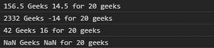
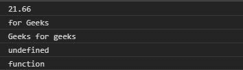

# D3.js 插值()函数

> 原文:[https://www . geesforgeks . org/D3-js-插值-函数/](https://www.geeksforgeeks.org/d3-js-interpolatestring-function/)

D3.js 中的 **intepolateString()** 函数用于返回两个字符串之间的插值函数。对于字符串“b”中的每个数字，该函数在字符串“a”中为其找到一个数字，然后使用 number 插值器函数返回这些数字的插值，字符串“b”的剩余部分用作模板。

**语法:**

```
d3.intepolateString(a, b);
```

**参数:**取两个参数:

*   **a:** 是一串字符和数字。
*   **b:** 也是一串字符和数字。

**返回:**返回插值函数。

下面给出了上述函数的几个例子。

**例 1:**

## 超文本标记语言

```
<!DOCTYPE html>
<html lang="en">
<head>
  <meta charset="UTF-8">
  <meta name="viewport"
        content="width=device-width,
                 initial-scale=1.0">
  <title>Document</title>
</head>
<style>
</style>
<body>
  <!--fetching from CDN of D3.js -->
  <script type = "text/javascript"
          src =
"https://d3js.org/d3.v4.min.js">
  </script>
  <script>
    let s1="42 geeks 16";
    let s2="500 Geeks 10 for 20 geeks"
    let interpolatoreFunc=d3.interpolateString(s1, s2);
    /* Note that the string alphabets of string b are
      same as output but the Numbers are changed.*/
    console.log(interpolatoreFunc(0.25))
    console.log(interpolatoreFunc(5))
    console.log(interpolatoreFunc(0))
    console.log(interpolatoreFunc())
  </script>
</body>
</html>
```

**输出:**



**例 2:**

## 超文本标记语言

```
<!DOCTYPE html>
<html lang="en">
<head>
  <meta charset="UTF-8">
  <meta name="viewport"
        content="width=device-width,
                 initial-scale=1.0">
  <title>Document</title>
</head>
<style>
</style>
<body>
  <!--Fetching from CDN of D3.js -->
  <script type = "text/javascript"
          src = "https://d3js.org/d3.v4.min.js">
  </script>
  <script>
    try{
     // Trying numbers with this function
      console.log(d3.interpolateString(24, 15)(0.26))
      // If oly string is given and no Number
      console.log(
d3.interpolateString("geeks", "for Geeks")(0.5))
      // If a is a number and b is a string
      console.log(
d3.interpolateString(24, "Geeks for geeks")(0.8))
      // If a is not given
      console.log(
d3.interpolateString("13 geeks")(0.46))
      console.log(
typeof d3.interpolateString("2 asda", "13 geeks"))
    }
    catch(err){
      throw err;
    }

  </script>
</body>
</html>
```

**输出:**

