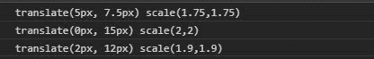
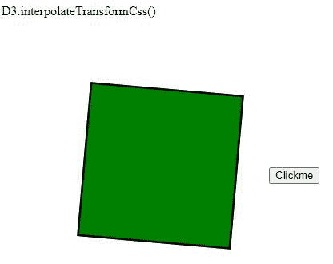

# D3.js 插值转换公式()函数

> 原文:[https://www . geeksforgeeks . org/D3-js-插值 transformcss-function/](https://www.geeksforgeeks.org/d3-js-interpolatetransformcss-function/)

D3.js 中的 **d3 .插值转换表单()函数**用于返回两个给定的 CssTransform 属性之间的插值函数。变换的几个属性，如平移、旋转、倾斜和缩放，可以在这里使用。

**语法:**

```
d3.interpolateTransformCss(a, b); 
```

**参数:**

*   **a:** 是 CSS Transform 属性的字符串。
*   **b:** 是 CSS Transform 属性的字符串。

**返回:**返回插值函数。

下面给出了上述函数的几个例子。

**例 1:**

## 超文本标记语言

```
<!DOCTYPE html>
<html lang="en">
<head>
  <meta charset="UTF-8">
  <meta name="viewport"
        content="width=device-width,
                 initial-scale=1.0">
  <title>Document</title>
</head>
<style>
</style>
<body>
  <!--Fetching from CDN of D3.js -->
  <script type = "text/javascript"
          src = "https:// d3js.org/d3.v4.min.js">
  </script>
  <script>
// It gives the intermediate value between two given properties
    console.log(d3.interpolateTransformCss(
    "translateX(10px) scale(1.5)",
    "translateY(15px) scale(2)"
  )(0.5))
// It gives interpolate value with 0 part of "a" and 1 part of "b"
    console.log(d3.interpolateTransformCss(
    "translateX(10px) scale(1.5)",
    "translateY(15px) scale(2)"
  )(1))
// It gives interpolate value with 0.2 part of "a" and 0.8 part of "b"
    console.log(d3.interpolateTransformCss(
    "translateX(10px) scale(1.5)",
    "translateY(15px) scale(2)"
  )(0.8))
 </script>
</body>
</html>
```

**输出:**



**例 2:**

## 超文本标记语言

```
<!DOCTYPE html>
<html lang="en">
<head>
  <meta charset="UTF-8">
  <meta name="viewport"
        content="width=device-width,
                 initial-scale=1.0">
  <title>Document</title>
</head>
<style>
  .box1{
    margin-bottom: 40px;
    color: white;
    border: 2px solid black;
    width: 150px;
    height: 150px;
    background-color: green;
    transform: scale();
  }
  div{
    height: 100vh;
    display:flex;
    margin-left: 60px;
    align-items: center;
  }
</style>
<body>
  D3.interpolateTransformCss()
  <div>
    <div class="box1">
    </div>
    <div class="box2">
    </div>
    <button>Clickme</button>
  </div>
  <!--fetching from CDN of D3.js -->
  <script type = "text/javascript"
          src = "https://d3js.org/d3.v4.min.js">
   </script>
  <script>
    let box1=document.querySelector(".box1");
    let btn=document.querySelector("button");
    let interpolateFunc=d3.interpolateTransformCss(
    "translateY(15px) scale(1.5)",
    "translateX(3px) rotate(10deg)"
  )(0.5);
  func=()=>{
    box1.style.transform=interpolateFunc;
  }
  btn.addEventListener("click", func);
  </script>
</body>
</html>
```

**输出:**

点击前:


点击后:

