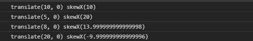
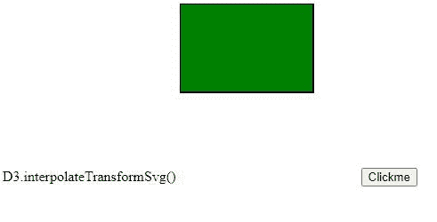

# D3.js 插值转换公式()函数

> 原文:[https://www . geeksforgeeks . org/D3-js-插值 transformsvg-function/](https://www.geeksforgeeks.org/d3-js-interpolatetransformsvg-function/)

[D3.js](https://www.geeksforgeeks.org/d3-js-data-driven-documents/) 中的**插值变换 Svg()** 函数用于返回两个给定 Svg 变换之间的插值函数。然后通过改变返回函数中 k 的值，可以设置不同的变换属性。

**语法:**

```
 interpolateTransformSvg(a, b);
```

**参数:**该函数接受两个参数，如上所述，如下所述:

*   答:这是 SVG 的变换性质。
*   这是奇异值分解的变换性质。

**返回:**返回插值函数。

下面给出了上述函数的几个例子。

**例 1:**

```
<!DOCTYPE html>
<html lang="en">
<head>
  <meta charset="UTF-8">
  <meta name="viewport" 
        content="width=device-width, 
                 initial-scale=1.0">
  <title>Document</title>
</head>
<style>
</style>
<body>
  <!--Fetching from CDN of D3.js -->
  <script type = "text/javascript"
          src = "https://d3js.org/d3.v4.min.js">
  </script>
  <script>
    console.log(d3.interpolateTransformSvg(
  "skewX(30)",
  "skewX(10) translate(10, 0)"
)(1))
    console.log(d3.interpolateTransformSvg(
  "skewX(30)",
  "skewX(10) translate(10, 0)"
)(0.5))
    console.log(d3.interpolateTransformSvg(
  "skewX(30)",
  "skewX(10) translate(10, 0)"
)(0.8))
    console.log(d3.interpolateTransformSvg(
  "skewX(30)",
  "skewX(10) translate(10, 0)"
)(2))
 </script>
</body>
</html>
```

**输出:**



**例 2:**

```
<!DOCTYPE html>
<html lang="en">
<head>
  <meta charset="UTF-8">
  <meta name="viewport" 
        content="width=device-width,
                 initial-scale=1.0">
  <title>Document</title>
</head>
<style>
</style>
<body>
  D3.interpolateTransformSvg()
  <svg class="box" 
       width="300px" 
       height="200px">

    <rect class="box1" 
          width="150px" 
          height="100px"
          fill="green" 
          stroke="black"
          stroke-width="2">
    </rect>
  </svg>
  <button>Clickme</button>
  <!--fetching from CDN of D3.js -->
  <script type = "text/javascript" 
          src = "https://d3js.org/d3.v4.min.js">
   </script>
  <script>
    let box=document.querySelector("rect");
    let btn=document.querySelector("button");
    let interpolateFunc=d3.interpolateTransformSvg(
      "skewX(60)",
      "skewY(30) translate(10, 0)"
  )(0.5);
  func=()=>{
    box.setAttribute("transform", interpolateFunc)
  }
  btn.addEventListener("click", func);
  </script>
</body>
</html>
```

**输出:**

**点击前:**



**点击后:**

