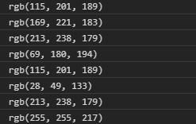

# D3.js 插值 lGnBu()函数

> 原文:[https://www . geeksforgeeks . org/D3-js-插值 lgnbu-function/](https://www.geeksforgeeks.org/d3-js-interpolateylgnbu-function/)

d3.js 中的 **d3 .插值 lGnBu()** 函数用于返回对应于顺序配色方案的 RGB 颜色字符串。

**语法:**

```
d3.interpolateYlGnBu(t);
```

**参数:**上面给定的函数只取上面给定的一个参数，如下所述:

*   **t:** 是一个范围在[0，1]的数值。

**返回值:**该函数返回一个字符串。

下面的例子说明了 d3.js 中的 D3 .插值 lGnBu()函数:

**例 1:**

## 超文本标记语言

```
<!DOCTYPE html>
<html lang="en">

<head>
    <meta charset="UTF-8">
    <meta name="viewport" content="width=device-width, 
                initial-scale=1.0">

    <!--Fetching from CDN of D3.js -->
    <script src="https://d3js.org/d3.v4.min.js">
    </script>
    <script src="https://d3js.org/d3-color.v1.min.js">
    </script>
    <script src=
    "https://d3js.org/d3-interpolate.v1.min.js">
    </script>
    <script src=
    "https://d3js.org/d3-scale-chromatic.v1.min.js">
    </script>
</head>

<body>
    <script>
        console.log(d3.interpolateYlGnBu(0.4));
        console.log(d3.interpolateYlGnBu(0.3));
        console.log(d3.interpolateYlGnBu(0.2));
        console.log(d3.interpolateYlGnBu(0.5));
        console.log(d3.interpolateYlGnBu(0.4));
        console.log(d3.interpolateYlGnBu(0.9));
        console.log(d3.interpolateYlGnBu(0.2));
        console.log(d3.interpolateYlGnBu(0));
    </script>
</body>

</html>
```

**输出:**



**例 2:**

## 超文本标记语言

```
<!DOCTYPE html>
<html lang="en">

<head>
    <meta charset="UTF-8">
    <meta name="viewport" content="width=device-width, 
                initial-scale=1.0">

    <!--Fetching from CDN of D3.js -->
    <script src="https://d3js.org/d3.v4.min.js"></script>
    <script src="https://d3js.org/d3-color.v1.min.js">
    </script>
    <script src=
    "https://d3js.org/d3-interpolate.v1.min.js">
    </script>
    <script src=
    "https://d3js.org/d3-scale-chromatic.v1.min.js">
    </script>

    <style>
        div {
            padding: 6px;
            text-align: center;
            vertical-align: middle;
            display: flex;
            justify-content: center;
            width: 100px;
            height: 100px;
            float: left;
        }
    </style>
</head>

<body>
    <h2>D3.interpolateYlGnBu() </h2>
    <div class="pixel1">
        <span>t = 0.4</span>
    </div>
    <div class="pixel2">
        <span>t = 0.6</span>
    </div>

    <script>

        // creating different colors for different
        // Values of t is 0.4
        let color1 =
            d3.interpolateYlGnBu(0.4);
        // Values of t is 0.6
        let color2 =
            d3.interpolateYlGnBu(0.6);

        // Selecting Div using query selector
        let pixel1 = document.querySelector(".pixel1");
        let pixel2 = document.querySelector(".pixel2");

        // Setting style and BG color of
        // the particular DIVs
        pixel1.style.backgroundColor = color1;
        pixel2.style.backgroundColor = color2;
    </script>
</body>

</html>
```

**输出:**

