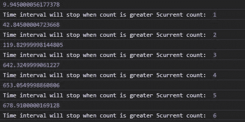
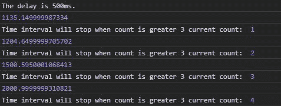

# D3.js 间隔()功能

> 原文:[https://www.geeksforgeeks.org/d3-js-interval-function/](https://www.geeksforgeeks.org/d3-js-interval-function/)

**d3.interval()** 函数用于在每个给定的时间间隔或延迟后调用该函数。如果没有给出延迟，那么延迟等于定时器。

**语法:**

```
d3.interval(callback, delay);

```

**参数:**取上述两个参数，描述如下:

*   **回调:**是特定延迟后要执行的功能。
*   **延迟:**是执行功能后的延迟。

**返回:**返回一个对象。

**注意:**每次执行代码时输出可能不一样。

**例 1:** 未给出延迟时。

## 超文本标记语言

```
<!DOCTYPE html>
<html lang="en">

<head>
    <meta charset="UTF-8">
    <meta name="viewport" content=
        "width=device-width, initial-scale=1.0">

    <style>
        .originalColor {
            height: 100px;
            width: 100px;
        }

        .darkerColor {
            height: 100px;
            width: 100px;
        }
    </style>
</head>

<body>
    <!-- Fetching from CDN of D3.js -->
    <script type="text/javascript" 
        src="https://d3js.org/d3.v4.min.js">
    </script>

    <script>
        let count = 0;
        let func = function (e) {
            count++;
            console.log(e);
            console.log("Time interval will "
                + "stop when count is greater 5" 
                + "current count: ", count);
            if (count > 5)
                timer.stop()
        }
        var timer = d3.interval(func);
    </script>
</body>

</html>
```

**输出:**



**例 2:** 当给定延迟时。

## 超文本标记语言

```
<!DOCTYPE html>
<html lang="en">

<head>
    <meta charset="UTF-8">
    <meta name="viewport" content=
        "width=device-width, initial-scale=1.0">

    <style>
        .originalColor {
            height: 100px;
            width: 100px;
        }

        .darkerColor {
            height: 100px;
            width: 100px;
        }
    </style>
</head>

<body>
    <!-- Fetching from CDN of D3.js -->
    <script type="text/javascript" 
        src="https://d3js.org/d3.v4.min.js">
    </script>

    <script>
        let count = 0;
        console.log("The delay is 500ms.");
        let func = function (e) {
            count++;
            console.log(e);
            console.log("Time interval will "
                + "stop when count is greater 3" 
                + " current count: ", count);
            if (count > 3)
                timer.stop()
        }
        var timer = d3.interval(func, 500);
    </script>
</body>

</html>
```

**输出:**

