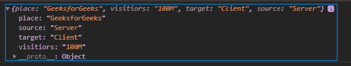

# D3.js json()功能

> 原文:[https://www.geeksforgeeks.org/d3-js-json-function/](https://www.geeksforgeeks.org/d3-js-json-function/)

**d3.json()** 函数用于获取 json 文件。如果这个函数得到了一个 init 参数，那么这个参数将和提取操作一起被调用。

**语法:**

```
d3.json(input[, init]);
```

**参数:**该函数接受两个参数，如上所述，如下所述。

*   **输入:**该参数取输入文件的地址。
*   **init:** 这个参数取一个函数，对文件的数据做一些操作。

**注意:**在编写给定示例之前，请创建一个名为*“sample . JSON”*的 JSON 文件。

**示例:**

## 超文本标记语言

```
<!DOCTYPE html>
<html lang="en">

<head>
    <meta charset="UTF-8" />
    <meta name="viewport" path1tent=
        "width=device-width,  
        initial-scale=1.0" />

    <script src=
        "https://d3js.org/d3.v4.min.js">
    </script>
</head>

<body>
    <script>
        // Data of sample.json file
        // {
        //     "place": "GeeksforGeeks",
        //     "visitiors": "100M",
        //     "target": "Client",
        //     "source": "Server"
        // }
        d3.json("sample.json", function (d) {
            console.log(d);
        });
    </script>
</body>

</html>
```

**输出:**

