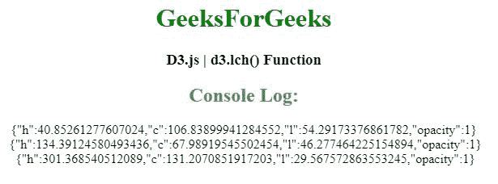
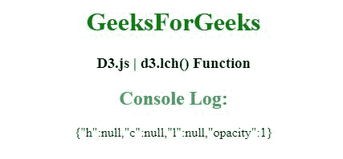

# D3 . js ich()函数

> 原文:[https://www.geeksforgeeks.org/d3-js-lch-function/](https://www.geeksforgeeks.org/d3-js-lch-function/)

D3.js 中的 **d3.lch()函数**用于构造新的 lch 颜色，并返回指定颜色的 l、c 和 h 属性作为函数的参数。

**语法:**

```
d3.lch(color);
```

**参数:** 该功能接受单参数 **颜色** ，用于指定 CSS 颜色。

**返回值:**该函数返回指定 CSS 颜色的 l、c、h 属性作为函数的参数。

以下程序说明了 D3.js 中的 **d3.lch()** 功能:

**例 1:**

## 超文本标记语言

```
<!DOCTYPE html>
<html lang="en">

<head>
    <script src=
        "https://d3js.org/d3.v4.min.js">
    </script>
    <script src=
        "https://d3js.org/d3-color.v1.min.js">
    </script>
</head>

<body>
    <center>
        <h1 style="color:green;">GeeksForGeeks</h1>

        <h3>D3.js | d3.lch() Function</h3>
        <script>

            // Calling the d3.lch() function
            // fuction with some parameters 
            var color1 = d3.lch("red");
            var color2 = d3.lch("green");
            var color3 = d3.lch("blue");

            // Getting the lch properties 
            console.log(color1);
            console.log(color2);
            console.log(color3); 
        </script>
    </center>
</body>

</html>
```

**输出:**



**例 2:**

## 超文本标记语言

```
<!DOCTYPE html>
<html lang="en">

<head>
    <script src=
        "https://d3js.org/d3.v4.min.js">
    </script>
    <script src=
        "https://d3js.org/d3-color.v1.min.js">
    </script>
</head>

<body>
    <center>
        <h1 style="color:green;">GeeksForGeeks</h1>

        <h3>D3.js | d3.lch() Function</h3>
        <script>

            // Calling the d3.lch() function
            // fuction with some parameters 
            var color = d3.lch();

            // Getting the LCH properties 
            console.log(color); 
        </script>
    </center>
</body>

</html>
```

**输出:**

