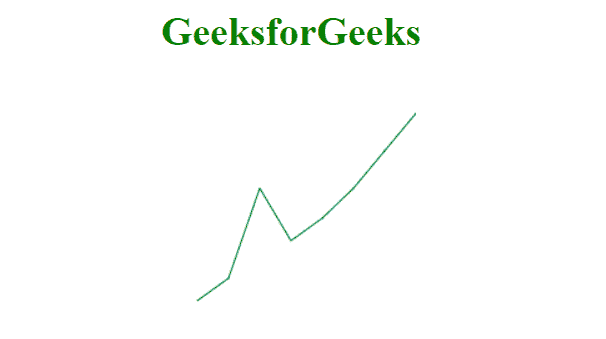
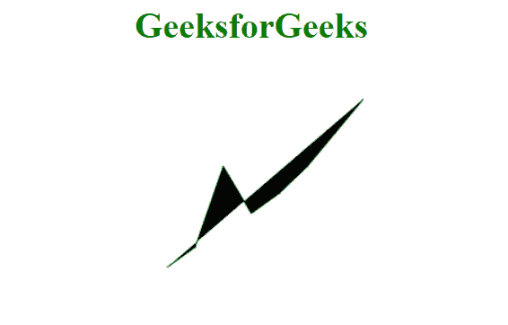

# D3.js line.context()方法

> 原文:[https://www.geeksforgeeks.org/d3-js-line-context-method/](https://www.geeksforgeeks.org/d3-js-line-context-method/)

**d3.line.context()方法**允许您在画布元素的上下文中渲染线条。调用行生成器时，将在当前上下文中呈现该行。我们可以使用这种方法自行设置线条的上下文，如颜色、笔画、填充等。默认值为空。

**语法:**

```html
d3.line.context(_context);
```

**参数:**

*   **_ 上下文:**用户设置的上下文。

**返回值:**该方法返回当前上下文。

**例 1:** 在本例中，使用此方法改变颜色、笔画。

```html
<!DOCTYPE html>
<html>
<meta charset="utf-8">
<head>
  <title>d3.line.defined()</title>
</head>
<script src=
"https://cdnjs.cloudflare.com/ajax/libs/d3/4.2.2/d3.min.js">
</script>

<body>
    <h1 style="text-align: center; 
        color: green;">
           GeeksforGeeks
    </h1>
  <center>
    <canvas id="gfg" width="200" height="200">
      </canvas>
</center>
  <script>
    var points = [
      {x: 0, y: 0},  
      {x: 1, y: 3},
      {x: 2, y: 15},
      {x: 3, y: 8},
      {x: 4, y: 11},
      {x: 5, y: 15},
      {x: 6, y: 20},
      {x: 7, y: 25}];
    var xp = d3.scaleLinear().domain([0, 7]).range([25, 200]);
    var yp = d3.scaleLinear().domain([0, 25]).range([175, 25]);
    var cont = d3.select("#gfg").node().getContext("2d");
    var line = d3.line()
      .x(d => xp(d.x))
      .y(d => yp(d.y))
      .context(cont);

    line(points);

    cont.strokeStyle = "green";
    cont.stroke();
</script>
</body>
</html>
```

**输出:**



**示例 2:** 在本示例中，使用此方法更改颜色、填充。

```html
<!DOCTYPE html>
<html>
<meta charset="utf-8">
<head>
  <title>d3.line.defined()</title>
</head>
<script src=
"https://cdnjs.cloudflare.com/ajax/libs/d3/4.2.2/d3.min.js">
 </script>

<body>
    <h1 style="text-align: center; color: green;">
         GeeksforGeeks
     </h1>
  <center>
    <canvas id="gfg" width="200" height="200"></canvas>
</center>
  <script>
    var points = [
      {x: 0, y: 0},  
      {x: 1, y: 3},
      {x: 2, y: 15},
      {x: 3, y: 8},
      {x: 4, y: 11},
      {x: 5, y: 15},
      {x: 6, y: 20},
      {x: 7, y: 25}];
    var xp = d3.scaleLinear().domain([0, 7]).range([25, 200]);
    var yp = d3.scaleLinear().domain([0, 25]).range([175, 25]);
    var cont = d3.select("#gfg").node().getContext("2d");
    var line = d3.line()
      .x(d => xp(d.x))
      .y(d => yp(d.y))
      .context(cont);

    line(points);

    cont.strokeStyle = "green";
    cont.fill();
</script>
</body>
</html>
```

**输出:**

