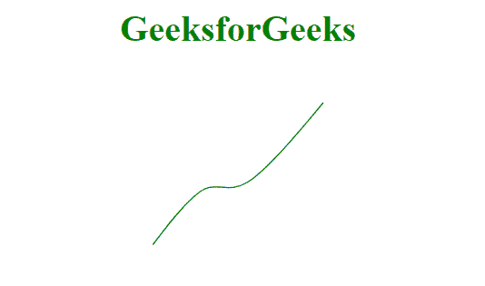
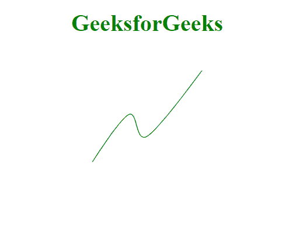

# D3.js 线.曲线()法

> 原文:[https://www.geeksforgeeks.org/d3-js-line-curve-method/](https://www.geeksforgeeks.org/d3-js-line-curve-method/)

**d3.line.curve()方法**用于给我们的直线一条曲线。D3.js 提供了几个曲线工厂，可以用来给出不同的曲线。

**语法:**

```html
d3.line.curve(curve_factory);
```

**参数:**

*   **曲线 _ 工厂:**给线的曲线类型。

**返回值:**这个方法没有返回值。

**示例 1:** 在本例中，我们将使用 curveBasis 曲线工厂。

```html
<!DOCTYPE html>
<html>
<meta charset="utf-8">
<head>
  <title>d3.line.curve()</title>
</head>
<script src=
"https://cdnjs.cloudflare.com/ajax/libs/d3/4.2.2/d3.min.js">
</script>

<body>
    <h1 style="text-align: center; 
        color: green;">GeeksforGeeks</h1>
  <center>
    <svg id="gfg" width="200" height="200"></svg>
</center>
  <script>
var points = [
  {xpoint: 25,  ypoint: 150},
  {xpoint: 75,  ypoint: 85},
  {xpoint: 100, ypoint: 115},
  {xpoint: 175, ypoint: 25}];

var Gen = d3.line()
  .x((p) => p.xpoint)
  .y((p) => p.ypoint)
  .curve(d3.curveBasis);

d3.select("#gfg")
  .append("path")
  .attr("d", Gen(points))
  .attr("fill", "none")
  .attr("stroke", "green");

</script>
</body>
</html>
```

**输出:**



**示例 2:** 在本例中，我们将使用 curveCardinal 曲线工厂。

```html
<!DOCTYPE html>
<html>
<meta charset="utf-8">
<head>
  <title>d3.line.curve()</title>
</head>
<script src=
"https://cdnjs.cloudflare.com/ajax/libs/d3/4.2.2/d3.min.js">
</script>

<body>
    <h1 style="text-align: center; 
               color: green;">
         GeeksforGeeks
    </h1>
  <center>
    <svg id="gfg" width="200" 
         height="200">
    </svg>
</center>
  <script>
var points = [
  {xpoint: 25,  ypoint: 150},
  {xpoint: 75,  ypoint: 85},
  {xpoint: 100, ypoint: 115},
  {xpoint: 175, ypoint: 25}];

var Gen = d3.line()
  .x((p) => p.xpoint)
  .y((p) => p.ypoint)
  .curve(d3.curveCardinal);

d3.select("#gfg")
  .append("path")
  .attr("d", Gen(points))
  .attr("fill", "none")
  .attr("stroke", "green");

</script>
</body>
</html>
```

**输出:**

