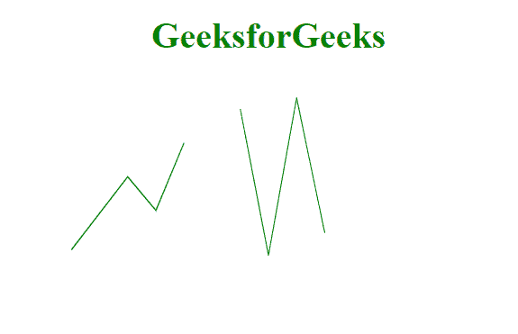
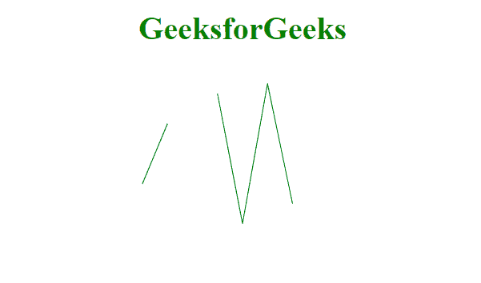

# D3.js line.defined()方法

> 原文:[https://www.geeksforgeeks.org/d3-js-line-defined-method/](https://www.geeksforgeeks.org/d3-js-line-defined-method/)

**d3.line.defined()方法**可以让您指定是否为给定的数据点定义了数据。如果此方法返回 false，这意味着数据点存在，否则返回 true。

**语法:**

```html
d3.line.defined(data_point);
```

**参数:**

*   **数据点:**待查数据点。

**返回值:**这个方法返回一个布尔值。

**例 1:** 在本例中，我们将使用此方法省略一些点。

```html
<!DOCTYPE html>
<html>
<meta charset="utf-8">
<head>
  <title>d3.line.defined()</title>
</head>
<script src=
"https://cdnjs.cloudflare.com/ajax/libs/d3/4.2.2/d3.min.js">
</script>

<body>
    <h1 style="text-align: center; 
               color: green;">
       GeeksforGeeks
    </h1>
  <center>
    <svg id="gfg" width="400" height="400">
      </svg>
</center>
  <script>
var points = [
      {xpoint: 25,  ypoint: 150},
      {xpoint: 75,  ypoint: 85},
      {xpoint: 100, ypoint: 115},
      {xpoint: 125, ypoint: 55},
      {xpoint: 150, ypoint: 105},
      {xpoint: 175, ypoint: 25},
      {xpoint: 200, ypoint: 155},
      {xpoint: 225, ypoint: 15},
      {xpoint: 250, ypoint: 135},
    ];

var Gen = d3.line()
  .x((p) => p.xpoint)
  .y((p) => p.ypoint)
  .defined(((d, i) => i != 4));

d3.select("#gfg")
  .append("path")
  .attr("d", Gen(points))
  .attr("fill", "none")
  .attr("stroke", "green");

</script>
</body>
</html>
```

**输出:**



**例 2:** 在本例中，我们将使用此方法省略零点。

```html
<!DOCTYPE html>
<html>
<meta charset="utf-8">
<head>
  <title>d3.line.defined()</title>
</head>
<script src=
"https://cdnjs.cloudflare.com/ajax/libs/d3/4.2.2/d3.min.js">
</script>

<body>
    <h1 style="text-align: center;
        color: green;">
        GeeksforGeeks
    </h1>
  <center>
    <svg id="gfg" width="400" height="400">
    </svg>
</center>
  <script>
var points = [
      {xpoint: 25,  ypoint: 150},
      {xpoint: 75,  ypoint: null},
      {xpoint: 100, ypoint: 115},
      {xpoint: 125, ypoint: 55},
      {xpoint: 150, ypoint: null},
      {xpoint: 175, ypoint: 25},
      {xpoint: 200, ypoint: 155},
      {xpoint: 225, ypoint: 15},
      {xpoint: 250, ypoint: 135},
    ];

var Gen = d3.line()
  .x((p) => p.xpoint)
  .y((p) => p.ypoint)
  .defined(function (d) { return d.ypoint !== null; });

d3.select("#gfg")
  .append("path")
  .attr("d", Gen(points))
  .attr("fill", "none")
  .attr("stroke", "green");

</script>
</body>
</html>
```

**输出:**

