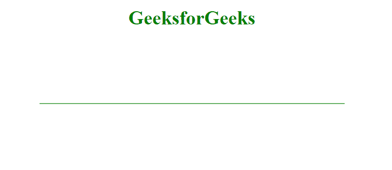
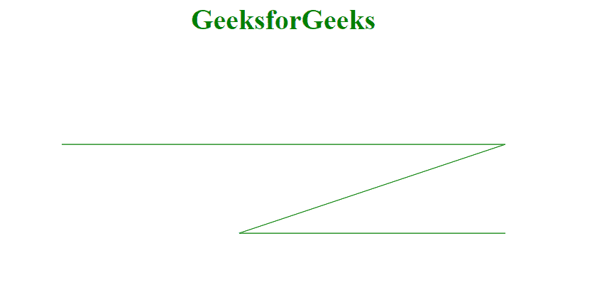

# D3.js 线()法

> 原文:[https://www.geeksforgeeks.org/d3-js-line-method/](https://www.geeksforgeeks.org/d3-js-line-method/)

d3.line()方法用于使用默认设置构造一个新的线生成器。线发生器然后被用来制作一条线。

**语法:**

```html
d3.line();
```

**参数:**该方法不取参数。

**返回值:**这个方法返回一个行生成器。

**例 1:** 用这种方法做一条简单的线。

```html
<!DOCTYPE html>
<html>
<meta charset="utf-8">
<head>
  <title>Line in D3.js</title>
</head>
<script src=
"https://cdnjs.cloudflare.com/ajax/libs/d3/4.2.2/d3.min.js">
</script>

<style>
path {
    fill: none;
    stroke: green;
}
</style>

<body>
    <h1 style="text-align: center;
        color: green;">GeeksforGeeks</h1>
  <center>
    <svg width="500" height="500">
    <path></path>
  </svg>
</center>
  <script>
        // Making a line Generator
        var Gen = d3.line();
        var points = [
            [0, 100],
            [500, 100]

        ];

        var pathOfLine = Gen(points);

        d3.select('path')
            .attr('d', pathOfLine);
  </script>
</body>
</html>
```

**输出:**



**示例 2:** 制作多连接线。

```html
<!DOCTYPE html>
<html>
<meta charset="utf-8">
<head>
  <title>Line in D3.js</title>
</head>
<script src=
"https://cdnjs.cloudflare.com/ajax/libs/d3/4.2.2/d3.min.js">
</script>

<style>
path {
    fill: none;
    stroke: green;
}
</style>

<body>
    <h1 style="text-align: center;
        color: green;">GeeksforGeeks</h1>
  <center>
    <svg width="500" height="500">
    <path></path>
  </svg>
</center>
  <script>
        // Making a line Generator
        var Gen = d3.line();
        var points = [
            [0, 100],
            [500, 100],
            [200, 200],
            [500, 200]

        ];

        var pathOfLine = Gen(points);

        d3.select('path')
            .attr('d', pathOfLine);
  </script>
</body>
</html>
```

**输出:**

