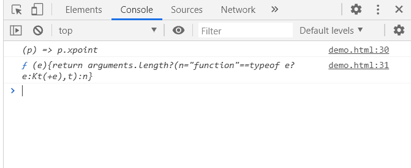

# D3.js line.x()方法

> 原文:[https://www.geeksforgeeks.org/d3-js-line-x-method/](https://www.geeksforgeeks.org/d3-js-line-x-method/)

**d3.line.x()方法**设置或获取该行的 x 取值点。如果提供了 x，它必须是一个数字或一个返回数字的函数。

**语法:**

```html
d3.line.x(x-point);
```

**参数:**

*   **x 点:**该方法取一个可以从点数组中设置的 x 点。

**返回值:**该方法返回该行的 x 取值点。

**例 1:** 使用该方法设置 x 点。对于 y 点，我们使用了 line.y()函数。

```html
<!DOCTYPE html>
<html>
<meta charset="utf-8">
<head>
  <title>Line in D3.js</title>
</head>
<script src=
"https://cdnjs.cloudflare.com/ajax/libs/d3/4.2.2/d3.min.js">
</script>

<body>
    <h1 style="text-align: center;
               color: green;">
         GeeksforGeeks
   </h1>
  <center>
    <svg id="gfg" width="200" height="200">
  </svg>
</center>
  <script>
var points = [
  {xpoint: 25,  ypoint: 150},
  {xpoint: 75,  ypoint: 85},
  {xpoint: 100, ypoint: 115},
  {xpoint: 175, ypoint: 25}];

var Gen = d3.line()
  // Setting the x-point
  .x((p) => p.xpoint)
  .y((p) => p.ypoint);

d3.select("#gfg")
  .append("path")
  .attr("d", Gen(points))
  .attr("fill", "none")
  .attr("stroke", "green");
</script>
</body>
</html>
```

**输出:**


**例 2:** 得到 x 点的函数。

```html
<!DOCTYPE html>
<html>
<meta charset="utf-8">
<head>
  <title>Line in D3.js</title>
</head>
<script src=
"https://cdnjs.cloudflare.com/ajax/libs/d3/4.2.2/d3.min.js">
</script>

<body>
    <h1 style="text-align: center; color: green;">
       GeeksforGeeks
    </h1>
  <center>
    <svg id="gfg" width="200" height="200"></svg>
</center>
  <script>
var points = [
  {xpoint: 25,  ypoint: 150},
  {xpoint: 75,  ypoint: 85},
  {xpoint: 100, ypoint: 115},
  {xpoint: 175, ypoint: 25}];

var Gen = d3.line()
  .x((p) => p.xpoint)
  .y((p) => p.ypoint);

d3.select("#gfg")
  .append("path")
  .attr("d", Gen(points))
  .attr("fill", "none")
  .attr("stroke", "green");
console.log(Gen.x());
console.log(Gen.x)
</script>
</body>
</html>
```

**输出:**

