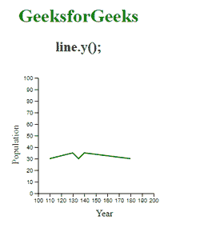

# D3.js line.y()功能

> 原文:[https://www.geeksforgeeks.org/d3-js-line-y-function/](https://www.geeksforgeeks.org/d3-js-line-y-function/)

**line.y()** 函数用于将 **y** 访问器设置为函数或数字，然后将其返回给 d3.line()函数调用的行生成器函数。如果未指定 y，则返回当前的 y 访问器。

**方法:**在这个创建折线图的示例中，首先创建 SVG 元素，并设置其宽度和高度，如下例所示。然后创建一个 CSV 文件，文件的数据在示例中给出。我们将组容器附加到 SVG 中。之后，使用 d3.line()函数创建一个**线生成器函数**。

创建线生成器函数后，设置 x 比例和 y 比例域和范围，并将比例附加到 SVG。然后用 line.x()和 **line.y()** 给出 x 轴和 y 轴的 x 轴数据和 y 轴数据。之后，将路径附加到 SVG，并将来自行生成器函数的数据赋予路径容器的“d”属性。给折线图一些风格，它就完成了。

**语法:**

```
line.y([y]);
```

**参数:**该函数接受一个参数，如上所述，如下所述。

*   **y:** 此参数用于设置 y-访问器。

**返回值:**这个函数不返回任何东西。

下面是上面给出的函数的几个例子。

**示例:**

```
<!DOCTYPE html> 
<html lang="en"> 
    <head> 
        <meta charset="UTF-8" /> 
        <meta
            property="viewport"
            content="width=device-width, 
                    initial-scale=1.0"/> 
        <title>GeeksforGeeks</title> 
        <!--Fetching from CDN of D3.js -->
        <script src= 
        "https://d3js.org/d3.v4.min.js"> 
        </script>
    </head>
    <body> 
        <div style="width:300px; height:300px;">
            <center>
                <h1 style="color:green">
                    GeeksforGeeks
                </h1> 
                <h2>
                    line.y();
                </h2> 
            </center>
            <svg width="300" height="300">
            </svg>
        </div>
        <script>
        // Selecting SVG and appending group tag
        var svg = d3.select("svg")
          .append("g")
            .attr("transform",
                  "translate(80, -80)");
        // Data for the CSV file
            // year, population
            // 110, 20
            // 130, 25
            // 135, 20
            // 140, 25
            // 180, 20

        // Fetching data from CSV file
        d3.csv("data.csv",
          (data)=>{
            // Setting domain and range of x-scale 
            var x = d3.scaleLinear()
              .domain([100, 200])
              .range([ 0, 200]);

            // Appending x-axis
            svg.append("g")
              .attr("transform", "translate(0, 300)")
              .call(d3.axisBottom(x));
              svg.append("text")             
                .attr("transform", "translate(100, 340)")
                .text("Year");

            // Setting domain and range of y-scale
            var y = d3.scaleLinear()
              .domain([0, 100])
              .range([ 200, 0 ]);

            // Appending y-axis
            svg.append("g")
              .attr("transform", "translate(0, 100)")
              .call(d3.axisLeft(y));

            svg.append("text")             
            .attr("transform", "rotate(-90)")
            .attr("y", -50)
            .attr("x", -250)
            .attr("dy", "1em")
            .text("Population");

            // Constructing line generator
            var line=d3.line();
            line.x(function(d) { return x(+d.year) });

            // Using line.x() Function
            line.y(function(d) { return y(+d.population) });

            // Appending the path i.e the line
            svg.append("path")
              .datum(data)
              .attr("stroke", "green")
              .attr("stroke-width", "2")
              .attr("fill", "none")
              .attr("d", line)
              .attr("transform", "translate(0, 80)");
        });
        </script> 
    </body> 
</html>
```

**输出:**

[](https://media.geeksforgeeks.org/wp-content/uploads/20200825220525/01-275x300.PNG)