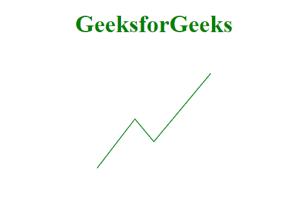
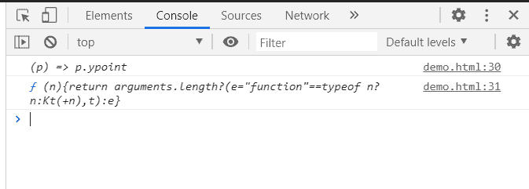

# D3.js line.y()方法

> 原文:[https://www.geeksforgeeks.org/d3-js-line-y-method/](https://www.geeksforgeeks.org/d3-js-line-y-method/)

**line.y()方法** 设置或返回直线的 y 取值点。如果提供了 y，它必须是一个数字或一个返回数字的函数。

**语法:**

```
d3.line.y();
```

**参数:**

*   **y 点:**该方法取一个可以从点数组中设置的 y 点。

**返回值:**该方法返回该行的 y 取值点。

**例 1:** 用这种方法设置 y 点。对于 x 点，这里我们使用了 line.x()函数。

## 超文本标记语言

```
<!DOCTYPE html>
<html>
<meta charset="utf-8">

<head>
    <script src=
"https://cdnjs.cloudflare.com/ajax/libs/d3/4.2.2/d3.min.js">
    </script>
</head>

<body>
    <h1 style="text-align:center; color:green;">
        GeeksforGeeks
    </h1>

    <center>
        <svg id="gfg" width="200" 
            height="200">
        </svg>
    </center>

    <script>
        var points = [
            { xpoint: 25, ypoint: 150 },
            { xpoint: 75, ypoint: 85 },
            { xpoint: 100, ypoint: 115 },
            { xpoint: 175, ypoint: 25 }];

        var Gen = d3.line()
            .x((p) => p.xpoint)
            // Setting the y-point
            .y((p) => p.ypoint);

        d3.select("#gfg")
            .append("path")
            .attr("d", Gen(points))
            .attr("fill", "none")
            .attr("stroke", "green");
    </script>
</body>

</html>
```

**输出:**



**例 2:** 得到 y 点的函数。

## 超文本标记语言

```
<!DOCTYPE html>
<html>
<meta charset="utf-8">

<head>
    <script src=
"https://cdnjs.cloudflare.com/ajax/libs/d3/4.2.2/d3.min.js">
    </script>
</head>

<body>
    <h1 style="text-align:center; color:green;">
        GeeksforGeeks
    </h1>

    <center>
        <svg id="gfg" width="200" height="200"></svg>
    </center>
    <script>
        var points = [
            { xpoint: 25, ypoint: 150 },
            { xpoint: 75, ypoint: 85 },
            { xpoint: 100, ypoint: 115 },
            { xpoint: 175, ypoint: 25 }];

        var Gen = d3.line()
            .x((p) => p.xpoint)
            .y((p) => p.ypoint);

        d3.select("#gfg")
            .append("path")
            .attr("d", Gen(points))
            .attr("fill", "none")
            .attr("stroke", "green");

        console.log(Gen.y());
        console.log(Gen.y)
    </script>
</body>

</html>
```

**输出:**

