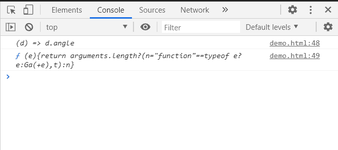

# D3.js 线径向角度()方法

> 原文:[https://www . geesforgeks . org/D3-js-line radial-angle-method/](https://www.geeksforgeeks.org/d3-js-lineradial-angle-method/)

**d3.lineRadial.angle()方法**是一个径向线访问器方法。它设置或返回角度访问器。如果提供了角度，它必须是一个数字或一个函数，该函数返回一个以弧度表示角度的数字。

**语法:**

```
d3.lineRadial.angle( angle );
```

**参数:**

*   **角度:**这个方法取一个角度，可以是一个数字，也可以是一个返回角度的函数。

**返回值:**该方法返回径向线的角度取值器。

**例 1:** 使用该方法设置角度。为了设置半径，我们使用了 lineRadial.radius()方法。

## 超文本标记语言

```
<!DOCTYPE html>
<html>

<head>
    <meta charset="utf-8">
    <script src=
"https://cdnjs.cloudflare.com/ajax/libs/d3/4.2.2/d3.min.js">
    </script>
    <script src=
        "https://d3js.org/d3.v4.min.js">
    </script>
</head>

<body>
    <h1 style="text-align:center; color:green;">
        GeeksforGeeks
    </h1>

    <center>
        <svg id="gfg" width="200" height="200">
            <g transform="translate(100,100)"></g>
        </svg>
    </center>

    <script>
        var lineRadialGenerator = d3.lineRadial();
        var data = [
            { angle: 0, radius: 10 },
            { angle: 3.14 * .5, radius: 35 },
            { angle: 3.14 * .75, radius: 55 },
            { angle: 3.14, radius: 60 },
            { angle: 3.14 * 1.25, radius: 65 },
            { angle: 3.14 * 1.5, radius: 70 },
            { angle: 3.14 * 1.75, radius: 75 },
            { angle: 3.14 * 2, radius: 80 },
            { angle: 3.14 * 2.25, radius: 85 },
            { angle: 3.14 * 2.5, radius: 90 },
            { angle: 3.14 * 2.75, radius: 95 },
            { angle: 3.14 * 3, radius: 100 },
            { angle: 3.14 * 3.25, radius: 105 },
            { angle: 3.14 * 3.5, radius: 110 }
        ];

        var lineRadialGenerator = d3.lineRadial()
            .angle((d) => d.angle)
            .radius((d) => d.radius);

        d3.select("#gfg")
            .select("g")
            .append("path")
            .attr("d", lineRadialGenerator(data))
            .attr("fill", "none")
            .attr("stroke", "green");
    </script>
</body>

</html>
```

**输出:**


**例 2:** 获取角度的函数。

## 超文本标记语言

```
<!DOCTYPE html>
<html>

<head>
    <meta charset="utf-8">
    <script src=
"https://cdnjs.cloudflare.com/ajax/libs/d3/4.2.2/d3.min.js">
    </script>
    <script src=
        "https://d3js.org/d3.v4.min.js">
    </script>
</head>

<body>
    <h1 style="text-align:center; color:green;">
        GeeksforGeeks
    </h1>

    <center>
        <svg id="gfg" width="200" height="200">
            <g transform="translate(100,100)"></g>
        </svg>
    </center>

    <script>
        var lineRadialGenerator = d3.lineRadial();
        var data = [
            { angle: 0, radius: 10 },
            { angle: 3.14 * .5, radius: 35 },
            { angle: 3.14 * .75, radius: 55 },
            { angle: 3.14, radius: 60 },
            { angle: 3.14 * 1.25, radius: 65 },
            { angle: 3.14 * 1.5, radius: 70 },
            { angle: 3.14 * 1.75, radius: 75 },
            { angle: 3.14 * 2, radius: 80 },
            { angle: 3.14 * 2.25, radius: 85 },
            { angle: 3.14 * 2.5, radius: 90 },
            { angle: 3.14 * 2.75, radius: 95 },
            { angle: 3.14 * 3, radius: 100 },
            { angle: 3.14 * 3.25, radius: 105 },
            { angle: 3.14 * 3.5, radius: 110 }
        ];

        var lineRadialGenerator = d3.lineRadial()
            .angle((d) => d.angle)
            .radius((d) => d.radius);

        d3.select("#gfg")
            .select("g")
            .append("path")
            .attr("d", lineRadialGenerator(data))
            .attr("fill", "none")
            .attr("stroke", "green");

        console.log(lineRadialGenerator.angle());
        console.log(lineRadialGenerator.angle);
    </script>
</body>

</html>
```

**输出:**

