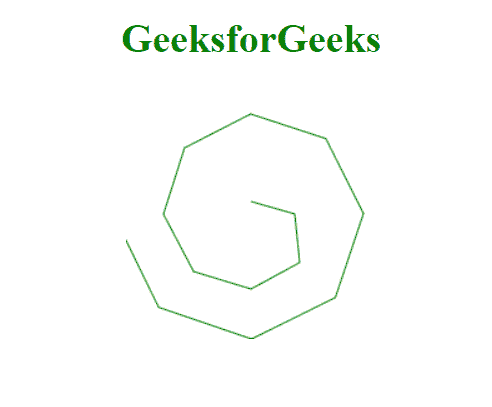
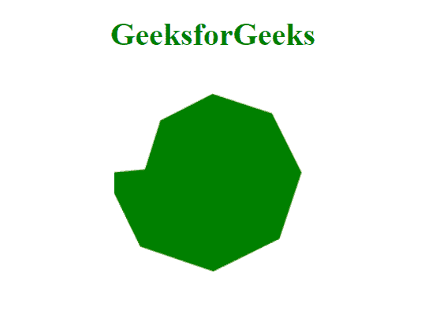

# D3.js lineRadial.context()方法

> 原文:[https://www . geesforgeks . org/D3-js-line radial-context-method/](https://www.geeksforgeeks.org/d3-js-lineradial-context-method/)

**d3.lineRadial.context()方法**允许您在画布元素的上下文中渲染线条。调用行生成器时，将在当前上下文中呈现该行。我们可以使用这种方法自行设置线条的上下文，如颜色、笔画、填充等。默认值为空。

**语法:**

```html
d3.lineRadial.context(_context);
```

**参数:**

*   **_ 上下文:**用户设置的上下文。

**返回值:**该方法返回当前上下文。

**例 1:** 在本例中，我们将使用这种方法改变颜色、笔画。

```html
<!DOCTYPE html>
<html>
<meta charset="utf-8">
<script src=
"https://cdnjs.cloudflare.com/ajax/libs/d3/4.2.2/d3.min.js">
</script>
<script src="https://d3js.org/d3.v4.min.js"></script> 
<body>
    <h1 style="text-align: center; color: green;">
         GeeksforGeeks
    </h1>
  <center>
    <canvas id="gfg" width="200" height="200">   
</canvas>
</center>

</body>
<script>
 var data = [
    {angle: 0, radius: 10},
    {angle: 3.14 * .5, radius: 35},
    {angle: 3.14 * .75, radius: 55},
    {angle: 3.14, radius: 60},
    {angle: 3.14 * 1.25, radius: 65},
    {angle: 3.14 * 1.5, radius: 70},
    {angle: 3.14 * 1.75, radius: 75},
    {angle: 3.14 * 2, radius: 80},
    {angle: 3.14 * 2.25, radius: 85},
    {angle: 3.14 * 2.5, radius: 90},
    {angle: 3.14 * 2.75, radius: 95},
    {angle: 3.14 * 3, radius: 100},
    {angle: 3.14 * 3.25, radius: 105},
    {angle: 3.14 * 3.5, radius: 110}
    ];

 var context = d3.select("#gfg").node().getContext("2d");

 var lineRadialGenerator = d3.lineRadial()
    .angle((d) => d.angle)
    .radius((d) => d.radius)
    .context(context);

 context.translate(100, 100);              
 lineRadialGenerator(data);
 context.strokeStyle = "green";
 context.stroke();

</script>   
</html>
```

**输出:**



**示例 2:** 在本例中，我们将使用此方法更改颜色、填充。

```html
<!DOCTYPE html>
<html>
<meta charset="utf-8">
<script src=
"https://cdnjs.cloudflare.com/ajax/libs/d3/4.2.2/d3.min.js">
</script>
<script src="https://d3js.org/d3.v4.min.js"></script> 
<body>
    <h1 style="text-align: center; color: green;">
        GeeksforGeeks
    </h1>
  <center>
    <canvas id="gfg" width="200" height="200">   
</canvas>
</center>

</body>
<script>
 var data = [
    {angle: 0, radius: 10},
    {angle: 3.14 * .5, radius: 35},
    {angle: 3.14 * .75, radius: 55},
    {angle: 3.14, radius: 60},
    {angle: 3.14 * 1.25, radius: 65},
    {angle: 3.14 * 1.5, radius: 70},
    {angle: 3.14 * 1.75, radius: 75},
    {angle: 3.14 * 2, radius: 80},
    {angle: 3.14 * 2.25, radius: 85},
    {angle: 3.14 * 2.5, radius: 90},
    {angle: 3.14 * 2.75, radius: 95},
    {angle: 3.14 * 3, radius: 100},
    {angle: 3.14 * 3.25, radius: 105},
    {angle: 3.14 * 3.5, radius: 110}
    ];

 var context = d3.select("#gfg").node().getContext("2d");

 var lineRadialGenerator = d3.lineRadial()
    .angle((d) => d.angle)
    .radius((d) => d.radius)
    .context(context);

 context.translate(100, 100);              
 lineRadialGenerator(data);
 context.fillStyle = "green";
 context.fill();

</script>   
</html>
```

**输出:**

