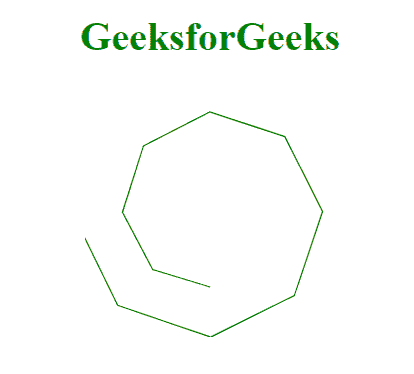
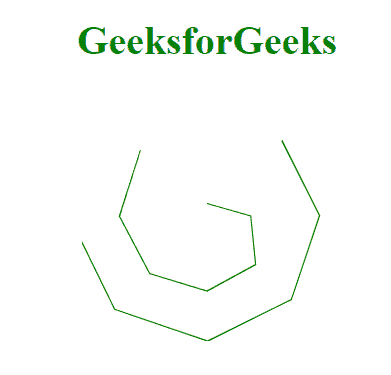

# D3.js lineRadial.defined()方法

> 原文:[https://www . geesforgeks . org/D3-js-line radial-defined-method/](https://www.geeksforgeeks.org/d3-js-lineradial-defined-method/)

**d3.lineRadial.defined()方法**允许您指定是否为给定的数据点、角度定义了数据。如果此方法返回 false，这意味着数据点存在，否则返回 true。

**语法:**

```html
d3.lineRadial.defined(data_point);
```

**参数:**

*   **数据点:**要检查的数据点，可以是角度、半径等。

**返回值:**这个方法返回一个布尔值。

**例 1:** 在本例中，我们将使用此方法省略某个角度。

```html
<!DOCTYPE html>
<html>
<meta charset="utf-8">
<script src=
"https://cdnjs.cloudflare.com/ajax/libs/d3/4.2.2/d3.min.js">
</script>
<script src="https://d3js.org/d3.v4.min.js"></script> 
<body>
    <h1 style="text-align: center; color: green;">
         GeeksforGeeks
    </h1>
  <center>
    <svg id="gfg" width="200" height="200">
    <g transform="translate(100, 100)"></g>
</svg>
</center>

</body>
<script>
 var lineRadialGenerator = d3.lineRadial();
 var data = [
    {angle: 0, radius: 10},
    {angle: 3.14 * .5, radius: 35},
    {angle: 3.14 * .75, radius: 55},
    {angle: 3.14, radius: 60},
    {angle: 3.14 * 1.25, radius: 65},
    {angle: 3.14 * 1.5, radius: 70},
    {angle: 3.14 * 1.75, radius: 75},
    {angle: 3.14 * 2, radius: 80},
    {angle: 3.14 * 2.25, radius: 85},
    {angle: 3.14 * 2.5, radius: 90},
    {angle: 3.14 * 2.75, radius: 95},
    {angle: 3.14 * 3, radius: 100},
    {angle: 3.14 * 3.25, radius: 105},
    {angle: 3.14 * 3.5, radius: 110}
    ];

 var lineRadialGenerator = d3.lineRadial()
    .angle((d) => d.angle)
    .radius((d) => d.radius)
    // Excluding specific angle
    .defined((d) => d.angle >= 3.14);

 d3.select("#gfg")
    .select("g")
    .append("path")
    .attr("d", lineRadialGenerator(data))
    .attr("fill", "none")
    .attr("stroke", "green");

</script>   
</html>
```

**输出:**



**例 2:**

```html
<!DOCTYPE html>
<html>
<meta charset="utf-8">
<script src=
"https://cdnjs.cloudflare.com/ajax/libs/d3/4.2.2/d3.min.js">
</script>
<script src="https://d3js.org/d3.v4.min.js"></script> 
<body>
    <h1 style="text-align: center; color: green;">
         GeeksforGeeks
    </h1>
  <center>
    <svg id="gfg" width="200" height="200">
    <g transform="translate(100, 100)"></g>
</svg>
</center>

</body>
<script>
 var lineRadialGenerator = d3.lineRadial();
 var data = [
    {angle: 0, radius: 10},
    {angle: 3.14 * .5, radius: 35},
    {angle: 3.14 * .75, radius: 55},
    {angle: 3.14, radius: 60},
    {angle: 3.14 * 1.25, radius: 65},
    {angle: 3.14 * 1.5, radius: 70},
    {angle: 3.14 * 1.75, radius: 75},
    {angle: null, radius: 80},
    {angle: 3.14 * 2.25, radius: 85},
    {angle: 3.14 * 2.5, radius: 90},
    {angle: 3.14 * 2.75, radius: 95},
    {angle: 3.14 * 3, radius: 100},
    {angle: 3.14 * 3.25, radius: 105},
    {angle: 3.14 * 3.5, radius: 110}
    ];

 var lineRadialGenerator = d3.lineRadial()
    .angle((d) => d.angle)
    .radius((d) => d.radius)
    // Excluding null angles
    .defined((d) => d.angle != null);

 d3.select("#gfg")
    .select("g")
    .append("path")
    .attr("d", lineRadialGenerator(data))
    .attr("fill", "none")
    .attr("stroke", "green");

</script>   
</html>
```

**输出:**

