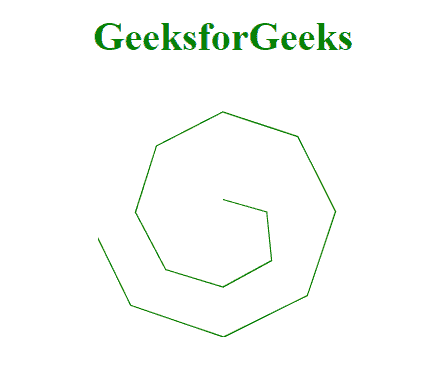
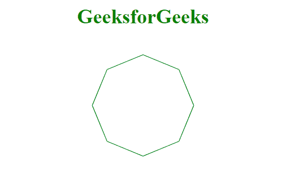

# D3.js lineRadial()方法

> 原文:[https://www.geeksforgeeks.org/d3-js-lineradial-method/](https://www.geeksforgeeks.org/d3-js-lineradial-method/)

使用 **d3.lineRadial()** 方法构建一个新的带有默认设置的径向线生成器。然后使用径向线生成器生成径向线。

**语法:**

```
d3.lineRadial();
```

**参数:**此方法不接受任何参数。

**返回值:**这个方法返回一个径向线生成器。

**示例 1:** 以下示例使用此方法制作径向曲线。

## 超文本标记语言

```
<!DOCTYPE html>
<html>

<head>
    <script src="
https://cdnjs.cloudflare.com/ajax/libs/d3/4.2.2/d3.min.js">
    </script>

    <script src="
https://d3js.org/d3.v4.min.js">
    </script>
</head>

<body>
    <h1 style="text-align:center;color: green;">
        GeeksforGeeks
    </h1>
    <center>
        <svg id="gfg" width="200" height="200">
            <g transform="translate(100, 100)"></g>
        </svg>
    </center>

    <script>
        var lineRadialGenerator = d3.lineRadial();
        var data = [
            [0, 10],
            [3.14 * .5, 35],
            [3.14 * .75, 55],
            [3.14, 60],
            [3.14 * 1.25, 65],
            [3.14 * 1.5, 70],
            [3.14 * 1.75, 75],
            [3.14 * 2, 80],
            [3.14 * 2.25, 85],
            [3.14 * 2.5, 90],
            [3.14 * 2.75, 95],
            [3.14 * 3, 100],
            [3.14 * 3.25, 105],
            [3.14 * 3.5, 110]];

        var a = lineRadialGenerator(data);

        d3.select("#gfg")
            .select("g")
            .append("path")
            .attr("d", a)
            .attr("fill", "none")
            .attr("stroke", "green");
    </script>
</body>

</html>
```

**输出:**



**例 2:**

## 超文本标记语言

```
<!DOCTYPE html>
<html>

<head>
    <meta charset="utf-8">

    <script src="
https://cdnjs.cloudflare.com/ajax/libs/d3/4.2.2/d3.min.js">
    </script>
    <script src=
        "https://d3js.org/d3.v4.min.js">
    </script>
</head>

<body>
    <h1 style="text-align:center; color:green;">
        GeeksforGeeks</h1>
    <center>
        <svg id="gfg" width="200" height="200">
            <g transform="translate(100, 100)"></g>
        </svg>
    </center>

    <script>
        var lineRadialGenerator = d3.lineRadial();
        var data = [
            [0, 80],
            [Math.PI * 0.25, 80],
            [Math.PI * 0.5, 80],
            [Math.PI * 0.75, 80],
            [Math.PI, 80],
            [Math.PI * 1.25, 80],
            [Math.PI * 1.5, 80],
            [Math.PI * 1.75, 80],
            [Math.PI * 2, 80]
        ];
        var a = lineRadialGenerator(data);

        d3.select("#gfg")
            .select("g")
            .append("path")
            .attr("d", a)
            .attr("fill", "none")
            .attr("stroke", "green");
    </script>
</body>

</html>
```

**输出:**

