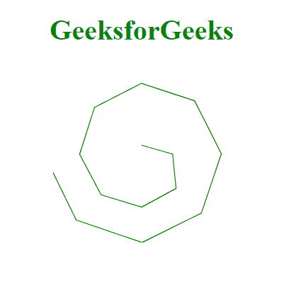
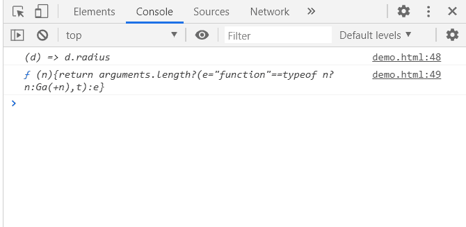

# D3.js 线径向半径()方法

> 原文:[https://www . geesforgeks . org/D3-js-line radial-radius-method/](https://www.geeksforgeeks.org/d3-js-lineradial-radius-method/)

**d3.lineRadial.radius()方法**是一个径向线访问器方法。它设置或获取 radius 访问器。如果提供了半径，它必须是一个数字或返回代表半径的数字的函数。

**语法:**

```html
d3.lineRadial.radius(radius);
```

**参数:**

*   **半径:**这个方法取的半径可以是一个数字，也可以是一个返回半径的函数。

**返回值:**该方法返回径向线的半径取值器。

**例 1:** 使用该方法设置半径。为了设置角度，我们使用了 lineRadial.angle()函数。

```html
<!DOCTYPE html>
<html>
<meta charset="utf-8">
<head>
  <title>D3.js | d3.lineRadial.radius()</title>
</head>
<script src=
"https://cdnjs.cloudflare.com/ajax/libs/d3/4.2.2/d3.min.js">
</script>
<script src="https://d3js.org/d3.v4.min.js"></script> 
<body>
    <h1 style="text-align: center; color: green;">
        GeeksforGeeks
    </h1>
  <center>
    <svg id="gfg" width="200" height="200">
    <g transform="translate(100, 100)"></g>
</svg>
</center>

</body>
<script>
 var lineRadialGenerator = d3.lineRadial();
 var data = [
    {angle: 0, radius: 10},
    {angle: 3.14 * .5, radius: 35},
    {angle: 3.14 * .75, radius: 55},
    {angle: 3.14, radius: 60},
    {angle: 3.14 * 1.25, radius: 65},
    {angle: 3.14 * 1.5, radius: 70},
    {angle: 3.14 * 1.75, radius: 75},
    {angle: 3.14 * 2, radius: 80},
    {angle: 3.14 * 2.25, radius: 85},
    {angle: 3.14 * 2.5, radius: 90},
    {angle: 3.14 * 2.75, radius: 95},
    {angle: 3.14 * 3, radius: 100},
    {angle: 3.14 * 3.25, radius: 105},
    {angle: 3.14 * 3.5, radius: 110}
    ];

var lineRadialGenerator = d3.lineRadial()
    .angle((d) => d.angle)
    .radius((d) => d.radius);

 d3.select("#gfg")
    .select("g")
    .append("path")
    .attr("d", lineRadialGenerator(data))
    .attr("fill", "none")
    .attr("stroke", "green");
</script>   
</html>
```

**输出:**



**例 2:** 求半径的函数。

```html
<!DOCTYPE html>
<html>
<meta charset="utf-8">
<head>
  <title>D3.js | d3.lineRadial.radius()</title>
</head>
<script src=
"https://cdnjs.cloudflare.com/ajax/libs/d3/4.2.2/d3.min.js">
</script>
<script src="https://d3js.org/d3.v4.min.js"></script> 
<body>
    <h1 style="text-align: center; color: green;">
         GeeksforGeeks
      </h1>
  <center>
    <svg id="gfg" width="200" height="200">
    <g transform="translate(100, 100)"></g>
</svg>
</center>

</body>
<script>
 var lineRadialGenerator = d3.lineRadial();
 var data = [
    {angle: 0, radius: 10},
    {angle: 3.14 * .5, radius: 35},
    {angle: 3.14 * .75, radius: 55},
    {angle: 3.14, radius: 60},
    {angle: 3.14 * 1.25, radius: 65},
    {angle: 3.14 * 1.5, radius: 70},
    {angle: 3.14 * 1.75, radius: 75},
    {angle: 3.14 * 2, radius: 80},
    {angle: 3.14 * 2.25, radius: 85},
    {angle: 3.14 * 2.5, radius: 90},
    {angle: 3.14 * 2.75, radius: 95},
    {angle: 3.14 * 3, radius: 100},
    {angle: 3.14 * 3.25, radius: 105},
    {angle: 3.14 * 3.5, radius: 110}
    ];

var lineRadialGenerator = d3.lineRadial()
    .angle((d) => d.angle)
    .radius((d) => d.radius);

 d3.select("#gfg")
    .select("g")
    .append("path")
    .attr("d", lineRadialGenerator(data))
    .attr("fill", "none")
    .attr("stroke", "green");

console.log(lineRadialGenerator.radius());
console.log(lineRadialGenerator.radius);
</script>   
</html>
```

**输出:**

