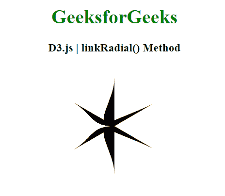

# D3.js linkRadial()方法

> 原文:[https://www.geeksforgeeks.org/d3-js-linkradial-method/](https://www.geeksforgeeks.org/d3-js-linkradial-method/)

**D3 . link radial()方法** r 使用径向切线创建一个新的链接生成器。t典型的用在根部居中，孩子从根部向外伸展的时候。

**语法:**

```
var link = d3.linkRadial()
    .angle(function(d) { return d.x; })
    .radius(function(d) { return d.y; });

```

**参数:**该函数不取任何参数。

**返回值:**这个方法返回一个新的链接生成器。

**示例:**

## 超文本标记语言

```
<!DOCTYPE html>
<html>
<head>
    <meta charset="utf-8">

    <script src=
        "https://d3js.org/d3.v5.min.js">
    </script>
</head>

<body>

    <h1 style="text-align: center; color: green;">
        GeeksforGeeks
    </h1>

    <h3 style="text-align: center;">
        D3.js | linkRadial() Method
    </h3>

    <center>
    <svg id="gfg" width="200" height="200"></svg>
    </center>

    <script>

        var data = [
            {source: [100,25], target: [175,175]},
            {source: [100,25], target: [25,175]},
            {source: [100,25], target: [125,175]},
            {source: [100,25], target: [75,175]},
            {source: [100,25], target: [225,175]},
            {source: [100,25], target: [275,175]},
            {source: [100,25], target: [125,175]}];

        // Radial link generator
        var link = d3.linkRadial()
                    .angle(d => xAngleScale(d[0]))
                    .radius(d => yRadiusScale(d[1]));

        var xAngleScale =
        d3.scaleLinear().domain([25,175]).range([Math.PI, Math.PI *2 ]);
        var yRadiusScale =
        d3.scaleLinear().domain([25,175]).range([0, 80]);

        //Adding the link paths
        d3.select("#gfg")
        .selectAll("path")
        .data(data)
        .join("path")
        .attr("d", link)
        .classed("link", true)
        .attr("transform", "translate(100,100)");

    </script>
</body>

</html>
```

**输出:**

