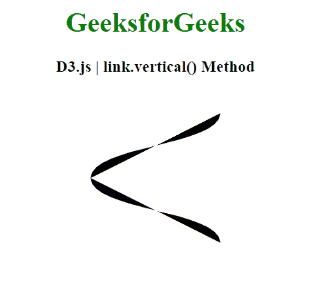

# D3.js linkVertical()方法

> 原文:[https://www.geeksforgeeks.org/d3-js-linkvertical-method/](https://www.geeksforgeeks.org/d3-js-linkvertical-method/)

**D3 . link vertical()方法** r 使用垂直切线创建一个新的链接生成器。t典型的用在牙根在左/右边缘，孩子向右/向左的时候。

**语法:**

```
var link = d3.linkVertical()
    .x(function(d) { return d.x; })
    .y(function(d) { return d.y; });

```

**参数:**该函数不取任何参数。

**返回值:**这个方法返回一个新的链接生成器。

**示例:**

## 超文本标记语言

```
<!DOCTYPE html>
<html>
<head>
    <meta charset="utf-8">

    <script src=
        "https://d3js.org/d3.v5.min.js">
    </script>
</head>

<body>

    <h1 style="text-align: center; color: green;">
        GeeksforGeeks
    </h1>

    <h3 style="text-align: center;">
        D3.js | link.vertical() Method
    </h3>

    <center>
    <svg id="gfg" width="200" height="200"></svg>
    </center>

    <script>
        var data = [
            {source: [100,25], target: [175,175]},
            {source: [100,25], target: [25,175]}];

        // Vertical link generator
        var link = d3.linkVertical()
                .source(function(d) {
                    return [d.source[1], d.source[0]];
                })
                .target(function(d) {
                    return [d.target[1], d.target[0]];
                });

        // Adding the link paths
        d3.select("#gfg")
            .selectAll("path")
            .data(data)
            .join("path")
            .attr("d", link)
            .classed("link", true);  
    </script>
</body>

</html>
```

**输出:**

