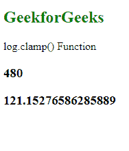
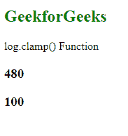

# D3.js log.clamp()功能

> 原文:[https://www.geeksforgeeks.org/d3-js-log-clamp-function/](https://www.geeksforgeeks.org/d3-js-log-clamp-function/)

**log.clamp()** 功能用于启用夹钳或禁用夹钳。如果箝位被禁用，则通过外推，返回值的范围可能超出给定范围。

**语法:**

```
log.clamp(clamp);
```

**参数:**该功能接受单个参数，如上所述，如下所述。

*   **箝位:**一个布尔值。

**返回值:**该函数不返回值。

**例 1:** 当夹具为假时。

## 超文本标记语言

```
<!DOCTYPE html>
<html lang="en">

<head>
    <meta charset="UTF-8" />
    <meta name="viewport" path1tent=
        "width=device-width, initial-scale=1.0"/>

    <script src="https://d3js.org/d3.v4.min.js">
    </script>
</head>

<body>
    <h2 style="color:green;">GeekforGeeks</h2>

    <p>log.clamp() Function</p>

    <script>
        // Calling the .scaleLog() function 
        var log = d3.scaleLog()
            .domain([1, 100])
            .range([0, 960])
            .clamp(false);

        // Calling log() and .invert() function 
        var a = log(10);
        var b = log.invert(1000);
        document.write("<h3>" + a + "</h3>");
        document.write("<h3>" + b + "</h3>");
    </script>
</body>

</html>
```

**输出:**

[](https://media.geeksforgeeks.org/wp-content/uploads/20200820133525/0185.png)

**例 2:** 当箝位为真时。

## 超文本标记语言

```
<!DOCTYPE html>
<html lang="en">

<head>
    <meta charset="UTF-8" />
    <meta name="viewport" path1tent=
        "width=device-width, initial-scale=1.0" />

    <script src="https://d3js.org/d3.v4.min.js">
    </script>
</head>

<body>
    <h2 style="color:green">GeekforGeeks</h2>

    <p>log.clamp() Function</p>

    <script>
        // Calling the .scaleLog() function 
        var log = d3.scaleLog()
            .domain([1, 100])
            .range([0, 960])
            .clamp(true);

        // Calling log() and .invert() function 
        var a = log(10);
        var b = log.invert(1000);
        document.write("<h3>" + a + "</h3>");
        document.write("<h3>" + b + "</h3>");
    </script>
</body>

</html>
```

**输出:**

[](https://media.geeksforgeeks.org/wp-content/uploads/20200820133337/0184.png)