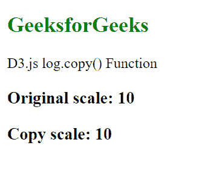
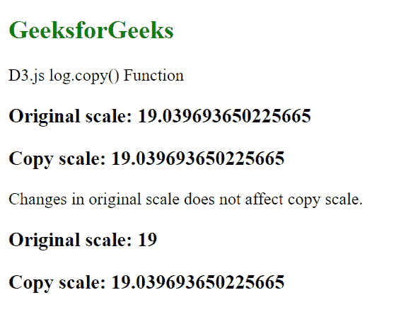

# D3.js log.copy()功能

> 原文:[https://www.geeksforgeeks.org/d3-js-log-copy-function/](https://www.geeksforgeeks.org/d3-js-log-copy-function/)

**log.copy()** 功能用于创建并返回原始刻度的精确副本。此副本不是原始比例的参考，因此原始比例的任何变化都不会影响副本比例。

**语法:**

```
log.copy()
```

**参数:**此功能不接受任何参数。

**返回值:**该函数返回原始刻度的精确副本。

下面是上面给出的函数的几个例子。

**例 1:**

```
<!DOCTYPE html>
<html lang="en">

<head>
    <meta charset="UTF-8" />
    <meta name="viewport" path1tent=
        "width=device-width, initial-scale=1.0"/>
    <script src="https://d3js.org/d3.v4.min.js">
    </script>
    <script src=
    "https://d3js.org/d3-color.v1.min.js">
    </script>
    <script src=
    "https://d3js.org/d3-interpolate.v1.min.js">
    </script>
    <script src=
    "https://d3js.org/d3-scale-chromatic.v1.min.js">
    </script>
</head>

<body>
    <h2 style="color:green;">
        GeeksforGeeks
    </h2>

    <p>D3.js log.copy() Function</p>

    <script>
        var log = d3.scaleLog()
            .domain([1, 20])
            .range([10, 20, 30, 40, 50, 60]);

        // Using log.copy() Function
        let logCopy = log.copy();
        document.write("<h3>Original scale: "
                + log(1) + "</h3>");

        document.write("<h3>Copy scale: " 
                + logCopy(1) + "</h3>");
    </script>
</body>

</html>
```

**输出:**



**例 2:**

```
<!DOCTYPE html>
<html lang="en">

<head>
    <meta charset="UTF-8" />
    <meta name="viewport" path1tent="width=device-width, 
    initial-scale=1.0" />
    <script src="https://d3js.org/d3.v4.min.js">
    </script>
    <script src=
    "https://d3js.org/d3-color.v1.min.js">
    </script>
    <script src=
    "https://d3js.org/d3-interpolate.v1.min.js">
    </script>
    <script src=
    "https://d3js.org/d3-scale-chromatic.v1.min.js">
    </script>
</head>

<body>
    <h2 style="color:green;">
        GeeksforGeeks
    </h2>

    <p>D3.js log.copy() Function</p>

    <script>
        var log = d3.scaleLog()
            .domain([1, 20])
            .range([10, 20, 30, 40, 50, 60]);

        // Using log.copy() Function
        let logCopy = log.copy();
        document.write("<h3>Original scale: " 
                    + log(15) + "</h3>");

        document.write("<h3>Copy scale: " 
                    + logCopy(15) + "</h3>");

        log.interpolate(d3.interpolateRound);

        document.write("<p>Changes in original "
            + "scale does not affect copy scale.</p>");

        document.write("<h3>Original scale: " 
                        + log(15) + "</h3>");

        document.write("<h3>Copy scale: " 
                    + logCopy(15) + "</h3>");
    </script>
</body>

</html>
```

**输出:**

