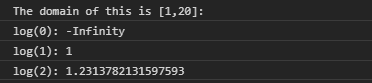
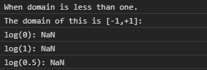

# D3.js log.domain()函数

> 原文:[https://www.geeksforgeeks.org/d3-js-log-domain-function/](https://www.geeksforgeeks.org/d3-js-log-domain-function/)

**log.domain()** 函数用于将标尺的定义域设置为指定的数字数组。此处指定的数组必须包含两个或两个以上的元素。默认情况下，域为[1，10]。

**语法:**

```
log.domain([domain]);
```

**参数:**该功能接受单个参数，如上所述，如下所述。

*   **【域】:**这是一个取两个或多个值的数组，用于指定域。

**返回值:**该函数不返回值。

下面的例子说明了 D3.js 中的 **log.domain()** 函数:

**例 1:**

## 超文本标记语言

```
<!DOCTYPE html>
<html lang="en">

<head>
    <meta charset="UTF-8" />
    <meta name="viewport" path1tent=
        "width=device-width, initial-scale=1.0"/>
    <script src="https://d3js.org/d3.v4.min.js">
    </script>
</head>

<body>
    <script>
        var log = d3.scaleLog()

            // Setting domain for the scale.
            // Domain can not be less than one.
            .domain([1, 20])
            .range(["1", "2", "3", "4", "5"]);
        console.log("The domain of this is [1,20]: ");
        console.log("log(0): " + log(0));
        console.log("log(1): " + log(1));
        console.log("log(2): " + log(2));
    </script>
</body>

</html>
```

**输出:**

[](https://media.geeksforgeeks.org/wp-content/uploads/20200818150248/0129.png)

**例 2:**

## 超文本标记语言

```
<!DOCTYPE html>
<html lang="en">

<head>
    <meta charset="UTF-8" />
    <meta name="viewport" path1tent=
        "width=device-width,initial-scale=1.0" />

    <script src="https://d3js.org/d3.v4.min.js">
    </script>
</head>

<body>
    <script>
        var log = d3.scaleLog()

            // Setting domain for the scale.
            .domain([-1, +1])
            .range(["1", "2", "3", "4", "5"]);
        console.log("When domain is less than one.");
        console.log("The domain of this is [-1,+1]: ");
        console.log("log(0): " + log(0));
        console.log("log(1): " + log(1));
        console.log("log(0.5): " + log(0.5));
    </script>
</body>

</html>
```

**输出:**

[](https://media.geeksforgeeks.org/wp-content/uploads/20200818150425/0130.png)