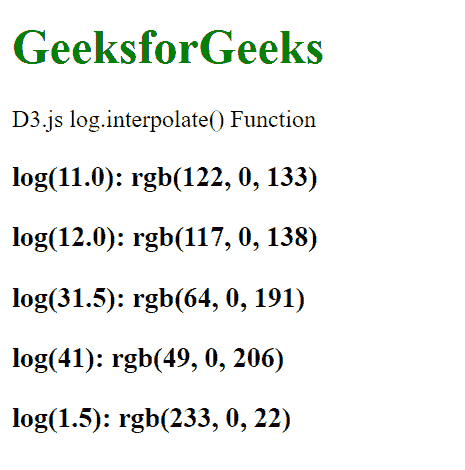

# D3 . js log . interpole()函数

> 原文:[https://www . geesforgeks . org/D3-js-log-INTERPOL-function/](https://www.geeksforgeeks.org/d3-js-log-interpolate-function/)

**log . interpole()**功能用于设置范围插值器工厂，该工厂用于为相邻范围的每对值创建插值器。如果未指定工厂，则返回当前的比例插值工厂。

**语法:**

```
log.interpolate(interpolate);

```

**参数:**该函数接受如上所述的单个参数，如下所述:

*   **插值器:**该参数接受插值器。

**方法:**首先使用 d3.js CDN 导入 d3.js，然后使用 **d3.scaleLog()** 功能制作对数刻度。该函数将返回一个对数刻度，然后使用 **log.domain()** 和 **log.range()** 函数设置刻度的区域和范围，如下例所示。然后将插值器更改为插值或环绕，将输出舍入到最接近的整数。使用 document.write()函数将输出写入文档。

**返回值:**这个函数不返回任何东西。

**例 1:**

```
<!DOCTYPE html>
<html lang="en">

<head>
    <meta charset="UTF-8" />
    <meta name="viewport" path1tent="width=device-width, 
    initial-scale=1.0" />
    <script src="https://d3js.org/d3.v4.min.js">
    </script>
</head>

<body>
    <h1 style="color:green;">
        GeeksforGeeks
    </h1>

    <p>D3.js log.interpolate() Function </p>

    <script>
        var log = d3.scaleLog()
            .domain([1, 10])
            .range([10, 20, 30, 40, 50, 60, 70, 80, 90])

            // Using interpolateRound
            .interpolate(d3.interpolateRound);

        document.write("<h3>log(1.0): " 
                + log(1.0) + "</h3>");
        document.write("<h3>log(2.0): " 
                + log(2.0) + "</h3>");
        document.write("<h3>log(3.5): " 
                + log(3.5) + "</h3>");
        document.write("<h3>log(4.1): " 
                + log(4.1) + "</h3>");
        document.write("<h3>log(1.5): " 
                + log(1.5) + "</h3>");
    </script>
</body>

</html>
```

**输出:**


**例 2:**

```
<!DOCTYPE html>
<html lang="en">

<head>
    <meta charset="UTF-8" />
    <meta name="viewport" path1tent="width=device-width, 
    initial-scale=1.0" />
    <script src="https://d3js.org/d3.v4.min.js">
    </script>
</head>

<body>
    <h1 style="color:green;">
        GeeksforGeeks
    </h1>

    <p>D3.js log.interpolate() Function </p>

    <script>
        var log = d3.scaleLog()
            .domain([1, 100])
            .range(["red", "blue"])

            // Using interpolate
            .interpolate(d3.interpolate);

        document.write("<h3>log(11.0): " 
                + log(11.0) + "</h3>");
        document.write("<h3>log(12.0): " 
                + log(12) + "</h3>");
        document.write("<h3>log(31.5): " 
                + log(31.5) + "</h3>");
        document.write("<h3>log(41): " 
                + log(41) + "</h3>");
        document.write("<h3>log(1.5): " 
                + log(1.5) + "</h3>");
    </script>
</body>

</html>
```

**输出:**

