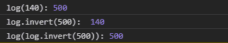

# D3.js log.invert()函数

> 原文:[https://www.geeksforgeeks.org/d3-js-log-invert-function/](https://www.geeksforgeeks.org/d3-js-log-invert-function/)

当给定范围内的值时， **log.invert()** 函数从域中返回一个值。这种反转对于交互很有用，例如确定对应于鼠标位置的数据值。

**语法:**

```
log.invert(value);
```

**参数:**该函数只接受一个如上所述的参数。

*   **值:**属于给定范围内任意值的数字。

**返回值:**该函数返回位于相应域中的数值。

**例 1:**

## 超文本标记语言

```
<!DOCTYPE html>
<html lang="en">

<head>
    <meta charset="UTF-8" />
    <meta name="viewport" path1tent="width=device-width, 
                   initial-scale=1.0" />
    <script src="https://d3js.org/d3.v4.min.js">
    </script>
</head>

<body>
    <script>
        var log = d3.scaleLog()
            .domain([10, 130])
            .range([0, 960]);
        console.log("log(130):", log(130));
        console.log("log.invert(960): ", 
                    log.invert(960))

        console.log("log(log.invert(15)):", 
                    log(log.invert(960)));
    </script>
</body>

</html>
```

**输出:**

[](https://media.geeksforgeeks.org/wp-content/uploads/20200818135231/0123.png)

**例 2:**

## 超文本标记语言

```
<!DOCTYPE html>
<html lang="en">

<head>
    <meta charset="UTF-8" />
    <meta name="viewport" path1tent=
    "width=device-width, initial-scale=1.0"/>

    <script src="https://d3js.org/d3.v4.min.js">
    </script>
</head>

<body>
    <script>
        var log = d3.scaleLog()
            .domain([10, 130, 140])
            .range([0, 96, 500]);
        console.log("log(140):", log(140));

        console.log("log.invert(500): ", 
                        log.invert(500))

        console.log("log(log.invert(500)):", 
                        log(log.invert(500)));
    </script>
</body>

</html>
```

**输出:**

[](https://media.geeksforgeeks.org/wp-content/uploads/20200818135609/0124.png)