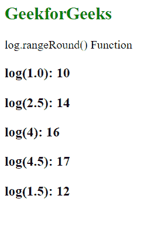
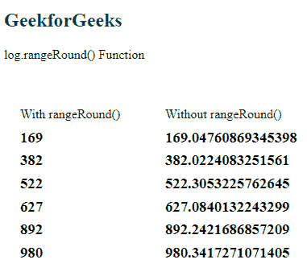

# D3.js log.rangeRound()函数

> 原文:[https://www . geesforgeks . org/D3-js-log-range round-function/](https://www.geeksforgeeks.org/d3-js-log-rangeround-function/)

**log.rangeRound()** 函数用于将刻度范围设置为指定的值数组，并在内部将插值器设置为插值或环绕。

**语法:**

```
log.rangeRound([range]);
```

**参数:**该函数采用上面给出并在下面描述的单个参数。

*   **【范围】:**包含指定域范围的数组。

**返回值:**该函数不返回值。

**例 1:**

## 超文本标记语言

```
<!DOCTYPE html>
<html lang="en">

<head>
    <meta charset="UTF-8" />
    <meta name="viewport" path1tent=
        "width=device-width,initial-scale=1.0" />
    <script src="https://d3js.org/d3.v4.min.js">
    </script>
</head>

<body>
    <h2 style="color:green">GeekforGeeks</h2>

    <p>log.rangeRound() Function</p>

    <script>
        var log = d3.scaleLog()
            // Domain
            .domain([1, 10])

            // Range for the domain
            .rangeRound([10, 20, 30, 40, 50, 60, 70, 80, 90]);

        document.write("<h3>log(1.0): " + log(1.0) + "</h3>");
        document.write("<h3>log(2.5): " + log(2.5) + "</h3>");
        document.write("<h3>log(4): " + log(4) + "</h3>");
        document.write("<h3>log(4.5): " + log(4.5) + "</h3>");
        document.write("<h3>log(1.5): " + log(1.5) + "</h3>");
    </script>
</body>

</html>
```

**输出:**



**例 2:**

## 超文本标记语言

```
<!DOCTYPE html>
<html lang="en">

<head>
    <meta charset="UTF-8" />
    <meta name="viewport" path1tent="width=device-width, 
                   initial-scale=1.0" />
    <script src="https://d3js.org/d3.v4.min.js">
    </script>
</head>

<body>
    <h2 style="color:green">GeekforGeeks</h2>

    <p>log.rangeRound() Function</p>

    <script>
        var log = d3.scaleLog()
            // Domain
            .domain([1, 10])
            // Range for the domain
            .rangeRound([0, 960]);

        document.write("<br/><div style=float:left;>");
        document.write("<p> With rangeRound()</p>");
        document.write("<h3>" + log(1.5) + "</h3>");
        document.write("<h3>" + log(2.5) + "</h3>");
        document.write("<h3>" + log(3.5) + "</h3>");
        document.write("<h3>" + log(4.5) + "</h3>");
        document.write("<h3>" + log(8.5) + "</h3>");
        document.write(
            "<h3>" + log(10.5) + "</h3></div>");

        var log = d3.scaleLog()
            // Domain
            .domain([1, 10])
            // Range for the domain
            .range([0, 960]);

        document.write(
          "<div style=margin-left:10px;float:left;>");
        document.write("<p> Without rangeRound()</p>");
        document.write("<h3>" + log(1.5) + "</h3>");
        document.write("<h3>" + log(2.5) + "</h3>");
        document.write("<h3>" + log(3.5) + "</h3>");
        document.write("<h3>" + log(4.5) + "</h3>");
        document.write("<h3>" + log(8.5) + "</h3>");
        document.write(
            "<h3>" + log(10.5) + "</h3></div>");
    </script>
</body>

</html>
```

**输出:**

[](https://media.geeksforgeeks.org/wp-content/uploads/20200820141801/0188.png)