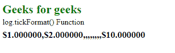
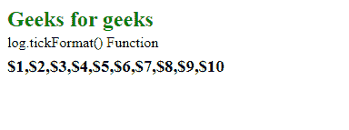

# D3.js log.tickFormat()函数

> 原文:[https://www . geesforgeks . org/D3-js-log-tick format-function/](https://www.geeksforgeeks.org/d3-js-log-tickformat-function/)

**log.ticksFormat()** 函数用于格式化 log.ticks()函数返回的 tick。这个函数类似于 pow.tickFormat()，唯一的区别是这个函数是为对数刻度定制的。如果刻度太多，格式化程序可能会为某些刻度返回空字符串，这样可以避免将计数设置为无穷大。

**语法:**

```
log.tickFormat([count[, specifier]]);
```

**参数:**该函数接受两个参数，如上所述，如下所述:

*   **计数:**是刻度值的个数。
*   **说明符:**说明符是格式类型为“s”的字符串。

**返回值:**这个函数不返回任何东西。

下面是上面给出的函数的几个例子。

**例 1:**

```
<!DOCTYPE html>
<html lang="en">

<head>
    <meta charset="UTF-8" />
    <meta name="viewport" path1tent="width=device-width, 
    initial-scale=1.0" />
    <script src="https://d3js.org/d3.v4.min.js">
    </script>
    <script src="https://d3js.org/d3-color.v1.min.js">
    </script>
    <script src="https://d3js.org/d3-interpolate.v1.min.js">
    </script>
    <script src="https://d3js.org/d3-scale-chromatic.v1.min.js">
    </script>
</head>

<body>
    <h1 style="color:green;">
        Geeks for geeks
    </h1>

    <p>log.tickFormat() Function</p>

    <script>
        var log = d3.scaleLog()
            .domain([1, 14])
            .range([1, 2, 3, 4]);

        var ticks = log.ticks(2);
        var tickFormat = log.tickFormat(2, "$, f");

        document.write("<h3>" +
            ticks.map(tickFormat) + "</h3>");
    </script>
</body>

</html>
```

**输出:**

[](https://media.geeksforgeeks.org/wp-content/uploads/20200818144510/0127.png)

**例 2:**

```
<!DOCTYPE html> 
<html lang="en"> 
<head> 
    <meta charset="UTF-8" /> 
    <meta name="viewport" path1tent="width=device-width, 
    initial-scale=1.0"/> 
    <script src="https://d3js.org/d3.v4.min.js">
    </script> 
    <script src="https://d3js.org/d3-color.v1.min.js">
    </script> 
    <script src="https://d3js.org/d3-interpolate.v1.min.js">
    </script> 
    <script src="https://d3js.org/d3-scale-chromatic.v1.min.js">
    </script> 
</head> 

<body> 
    <h1 style="color:green;">
        Geeks for geeks
    </h2>

    <p>log.tickFormat() Function </p>

    <script> 
        var log = d3.scaleLog()
            .domain([1, 14])
            .range([1, 2, 3, 4]);

        var ticks = log.ticks(Infinity);
        var tickFormat = log.tickFormat(Infinity, "{content}quot;);

        document.write("<h3>" +
            ticks.map(tickFormat) + "</h3>");
    </script> 
</body> 

</html>
```

**输出:**

[](https://media.geeksforgeeks.org/wp-content/uploads/20200818144610/0128.png)