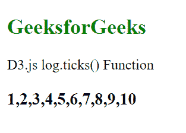
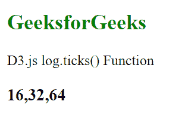

# D3.js log.ticks()函数

> 原文:[https://www.geeksforgeeks.org/d3-js-log-ticks-function/](https://www.geeksforgeeks.org/d3-js-log-ticks-function/)

**log.ticks()** 函数用于返回在基数的每个整数次方中均匀分布的刻度，并且每个刻度位于刻度的区域中。ticks()返回的值位于域中。如果域内的顺序大于计数，则返回每幂一个刻度。如果计数不是作为参数给出的，那么默认情况下它被设置为 10。

**语法:**

```
log.ticks([count]);
```

**参数:**该函数接受如上所述的单个参数，如下所述:

*   **计数:**是需要的刻度数。

**返回值:**这个函数不返回任何东西。

下面是上面给出的函数的几个例子。

**例 1:**

```
<!DOCTYPE html>
<html lang="en">

<head>
    <meta charset="UTF-8" />
    <meta name="viewport" path1tent=
        "width=device-width, initial-scale=1.0" />
    <script src="https://d3js.org/d3.v4.min.js">
    </script>
    <script src=
    "https://d3js.org/d3-color.v1.min.js">
    </script>
    <script src=
    "https://d3js.org/d3-interpolate.v1.min.js">
    </script>
    <script src=
    "https://d3js.org/d3-scale-chromatic.v1.min.js">
    </script>
</head>

<body>
    <h2 style="color:green;">
        GeeksforGeeks
    </h2>

    <p>D3.js log.ticks() Function </p>

    <script>
        var log = d3.scaleLog()
            .domain([1, 10])
            .range([1, 5])
            .ticks(8)
        document.write("<h3>" + log + "</h3>")
    </script>
</body>

</html>
```

**输出:**



**例 2:当基数设为 2 时**

```
<!DOCTYPE html>
<html lang="en">

<head>
    <meta charset="UTF-8" />
    <meta name="viewport" path1tent=
        "width=device-width, initial-scale=1.0" />
    <script src="https://d3js.org/d3.v4.min.js">
    </script>
    <script src=
    "https://d3js.org/d3-color.v1.min.js">
    </script>
    <script src=
    "https://d3js.org/d3-interpolate.v1.min.js">
    </script>
    <script src=
    "https://d3js.org/d3-scale-chromatic.v1.min.js">
    </script>
</head>

<body>
    <h2 style="color:green;">
        GeeksforGeeks
    </h2>

    <p>D3.js log.ticks() Function</p>

    <script>
        var log = d3.scaleLog()
            .domain([10, 100])
            .range(["red", "green"])
            .base(2)
        var tick = log.ticks(8)
        document.write("<h3>" + tick + "</h3>")
    </script>
</body>

</html>
```

**输出:**

