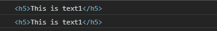
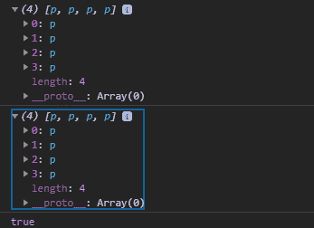

# D3.js 匹配器()功能

> 原文:[https://www.geeksforgeeks.org/d3-js-matcher-function/](https://www.geeksforgeeks.org/d3-js-matcher-function/)

d3.js 中的 **d3.matcher()** 函数用于返回一个函数，该函数根据元素返回真或假。如果元素匹配，则返回真，否则返回假。

**语法:**

```
d3.matcher(selector);
```

**参数:**上面给定的函数只取上面给定的一个参数，如下所述:

*   **选择器:**这里选择器是要匹配的 HTML 标签的名称。

**返回值:**该函数返回一个返回布尔值的函数。

下面是上面给出的函数的几个例子。

**示例 1:**

```
<!DOCTYPE html> 
<html lang="en"> 
<head> 
    <meta charset="UTF-8"> 
    <meta name="viewport"
            path1tent="width=device-width, 
                    initial-scale=1.0"> 
    <title>Document</title> 
</head> 
<style>
    h5{
        line-height:5px;
    }
</style> 
<body>  
    <div>

    </div>
    <div>
        <h5>This is text1</h5>
        <h5>This is text2</h5>
        <h5>This is text3</h5>
        <h5>This is text4</h5>
    </div>
  <script src = 
"https://d3js.org/d3.v4.min.js"> 
  </script>
  <script>
    var heading= d3.selectAll("h5");
    var matcher=heading.filter(d3.matcher("h5"))
                       .node();
    var filter=heading.filter(d3.matcher("h5"))
                      .node();
    console.log(matcher);
    console.log(filter);
  </script> 
</body> 
</html>
```

**输出:**



**例 2:**

```
<!DOCTYPE html> 
<html lang="en"> 
<head> 
    <meta charset="UTF-8"> 
    <meta name="viewport"
            path1tent="width=device-width, 
                    initial-scale=1.0"> 
    <title>Document</title> 
</head> 
<style>
    p{
        line-height:5px;
    }
</style> 
<body>  
    <div>

    </div>
    <div>
        <p>This is text1</p>
        <p>This is text2</p>
        <p>This is text3</p>
        <p>This is text4</p>
    </div>
  <script src = 
"https://d3js.org/d3.v4.min.js"> 
  </script>
</script>
  <script>
    var heading= d3.selectAll("p");
    var matcher=heading.filter(d3.matcher("p"))
                       .nodes();
    var filter=heading.filter(d3.matcher("p"))
                      .nodes();
    // Matcher and filter are same and equal
    console.log(matcher);
    console.log(filter);
    // Matcher and filter are same and equal so it returns true
    console.log(matcher[0]==filter[0])
  </script> 
</body> 
</html>
```

**输出:**

