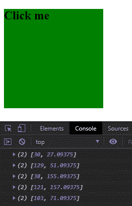
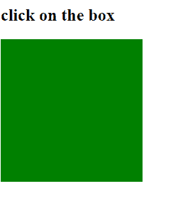
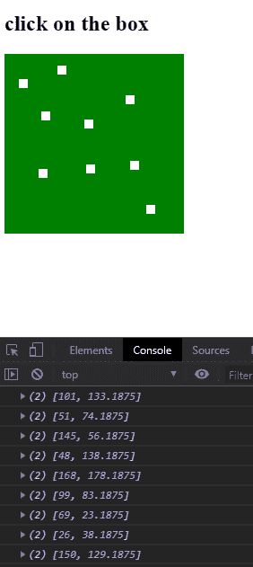

# D3.js 鼠标()功能

> 原文:[https://www.geeksforgeeks.org/d3-js-mouse-function/](https://www.geeksforgeeks.org/d3-js-mouse-function/)

D3.js 中的 **d3.mouse()** 功能用于返回当前事件的 x 坐标和 y 坐标。如果事件被点击，那么它返回点击的 x 和 y 位置。

**语法:**

```
d3.mouse(container);

```

**参数:**该函数接受如上所述的单个参数，如下所述:

*   **容器:**是事件附加的容器或 HTML 标签的名称。

**返回值:**返回坐标 x 和 y 的数组。

下面的例子说明了 JavaScript 中的 D3.js 鼠标()函数:

**示例 1:**

## 超文本标记语言

```
<!DOCTYPE html>
<html lang="en">
    <head>
        <meta charset="UTF-8" />
        <meta
            name="viewport"
            path1tent="width=device-width, 
                       initial-scale=1.0"/>
        <title>D3.js mouse() Function</title>
    </head>
    <style>
        div {
            width: 200px;
            height: 200px;
            background-color: green;
        }
    </style>
    <body>
        <div></div>
        <script src=
"https://d3js.org/d3.v4.min.js">
        </script>
        <script src=
"https://d3js.org/d3-selection.v1.min.js">
        </script>
        <script>
            let btn = document.querySelector("div");
            var div = d3.select("div");
            div.on("click", createDot);
            function createDot() {

                // Using d3.mouse() function
                let pos = d3.mouse(this);
                console.log(pos);
            }
        </script>
    </body>
</html>
```

**输出:**



**例 2:**

## 超文本标记语言

```
<!DOCTYPE html>
<html lang="en">
    <head>
        <meta charset="UTF-8" />
        <meta
            name="viewport"
            path1tent="width=device-width, 
                       initial-scale=1.0"/>
        <title>D3.js mouse() Function</title>
    </head>
    <style>
        .div {
            width: 200px;
            height: 200px;
            background-color: green;
            overflow: hidden;
        }
        div {
            background-color: red;
            width: 10px;
            height: 10px;
        }
    </style>
    <body>
        <h2>click on the box</h2>
        <div class="div"></div>
        <script src=
"https://d3js.org/d3.v4.min.js">
        </script>
        <script src=
"https://d3js.org/d3-selection.v1.min.js">
        </script>
        <script>
            let btn = document.querySelector("div");
            var div = d3.select("div");
            div.on("click", createDot);
            function createDot() {

                // Using d3.mouse() function
                let pos = d3.mouse(this);
                console.log(pos);
                d3.select("div")
                    .append("div")
                    .style("background-color", "white")
                    .style("position", "absolute")
                    .style("margin-left", `${pos[0] - 10}px`)
                    .style("margin-right", `${pos[0] - 10}px`)
                    .style("margin-top", `${pos[1] - 10}px`)
                    .style("margin-bottom", `${pos[1] - 10}px`);
            }
        </script>
    </body>
</html>
```

**输出:**

**点击框前:**



**点击框后:**

