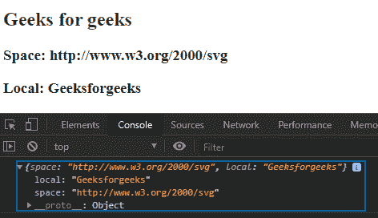
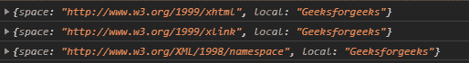

# D3.js 命名空间()函数

> 原文:[https://www.geeksforgeeks.org/d3-js-namespace-function/](https://www.geeksforgeeks.org/d3-js-namespace-function/)

**d3.namespace()** 函数用于返回一个对象，该对象包含描述完整命名空间 URL 和本地名称的空间和本地属性。如果名称中有一个冒号，那么冒号左侧的字符串就是命名空间前缀。

**语法:**

```
d3.namespace(name);
```

**参数:**该函数只包含一个参数，上面给出，下面描述。

*   **名称:**这是一个包含前缀的字符串，必须在**D3 . namespace**中注册。

**返回值:**该函数返回一个对象。

**例 1:**

## 超文本标记语言

```
<!DOCTYPE html>
<html lang="en">

<head>
    <meta charset="UTF-8" />
    <meta name="viewport" path1tent="width=device-width, 
        initial-scale=1.0" />
    <script src="https://d3js.org/d3.v4.min.js">
    </script>

    <style>
        h2 {
            color: green;
        }
    </style>
</head>

<body>
    <h2>Geeks for geeks</h2>
    <script>
        console.log(d3.namespace("svg:Geeksforgeeks"));
        document.write("<h3>Space: ", 
            d3.namespace("svg:Geeksforgeeks").space, "</h3>");
        document.write("<h3>Local: ", 
            d3.namespace("svg:Geeksforgeeks").local + "</h3>");
    </script>
</body>

</html>
```

**输出:**



**例 2:**

## 超文本标记语言

```
<!DOCTYPE html>
<html lang="en">

<head>
    <meta charset="UTF-8" />
    <meta name="viewport" path1tent="width=device-width, 
        initial-scale=1.0" />

    <script src="https://d3js.org/d3.v4.min.js">
    </script>
</head>

<body>
    <script>
        console.log(d3.namespace("xhtml:Geeksforgeeks"));
        console.log(d3.namespace("xlink:Geeksforgeeks"));
        console.log(d3.namespace("xml:Geeksforgeeks"));
    </script>
</body>

</html>
```

**输出:**

