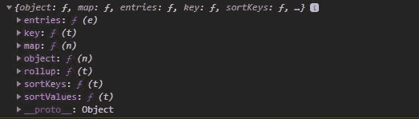
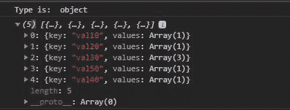

# D3.js nest.entries()函数

> 原文:[https://www.geeksforgeeks.org/d3-js-nest-entries-function/](https://www.geeksforgeeks.org/d3-js-nest-entries-function/)

D3.js 中的 **nest.entries()** 函数用于生成嵌套，它将嵌套操作符应用于层次结构的每一层，而不仅仅是最外层。

**语法:**

```
nest.entries(array)
```

**参数:**只取一个上面给定，下面描述的参数。

*   **数组:**是对象的数组。

**返回值:**返回键值条目数组。

下面给出了上述函数的几个例子。

**示例 1:** 当不使用输入功能并分配按键时。

```
<!DOCTYPE html>
<html lang="en">
<head>
  <meta charset="UTF-8">
  <meta name="viewport"
        content="width=device-width,
                 initial-scale=1.0">
  <title>Document</title>
</head>
<style>
</style>
<body>
  <!-- Fetching from CDN of D3.js -->
  <script type = "text/javascript" 
          src = "https://d3js.org/d3.v4.min.js">
  </script>
  <script>
    // Forming the array of objects
    let array=[
      {val:"val10", data:"data11"},
      {val:"val20", data:"data22"},
      {val:"val30", data:"data33"},
      {val:"val30", data:"data33"},
      {val:"val30", data:"data33"},
      {val:"val50", data:"data33"},
      {val:"val40", data:"data44"}
    ]
    let data= d3.nest()
                  .key(function(d) { return d.val; })
    console.log(data);
  </script>
</body>
</html>
```

**输出:**



**示例 2:** 当 entries 函数与 nest 一起使用时。

```
<!DOCTYPE html>
<html lang="en">
<head>
  <meta charset="UTF-8">
  <meta name="viewport" 
        content="width=device-width,
                       initial-scale=1.0">
  <title>Document</title>
</head>
<style>
</style>
<body>
  <!-- Fetching from CDN of D3.js -->
  <script type = "text/javascript" 
          src = "https://d3js.org/d3.v4.min.js">
 </script>
  <script>
    // Forming the array of objects
    let array=[
      {val:"val10", data:"data11"},
      {val:"val20", data:"data22"},
      {val:"val30", data:"data33"},
      {val:"val30", data:"data33"},
      {val:"val30", data:"data33"},
      {val:"val50", data:"data33"},
      {val:"val40", data:"data44"}
    ]
    let data= d3.nest()
                  .key(function(d) { return d.val; })
                  .entries(array)
    console.log("Type is: ", typeof array)
    console.log(data);
  </script>
</body>
</html>
```

**输出:**

