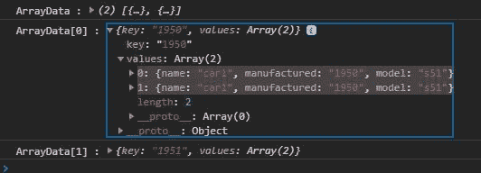
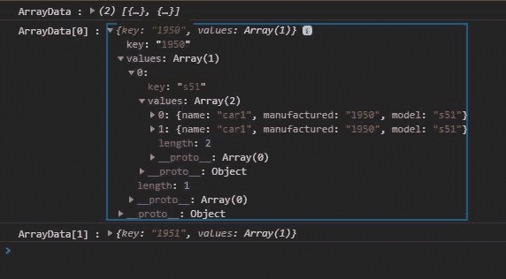

# D3.js nest()功能

> 原文:[https://www.geeksforgeeks.org/d3-js-nest-function/](https://www.geeksforgeeks.org/d3-js-nest-function/)

[D3.js](https://www.geeksforgeeks.org/d3-js-data-driven-documents/) 是一个用 javascript 构建的库，特别用于数据可视化。D3.nest()函数用于对数据进行分组，就像 SQL 中的 [groupBy](https://www.geeksforgeeks.org/sql-group-by/) 子句一样。它根据键和值对数据进行分组。

**语法:**

```
d3.nest()
```

**参数:**此功能不接受任何参数。

**返回值:**返回包含条目、关键字、值、映射、排序等属性的对象。

**示例 1:** 在本例中，数据将根据“制造”的密钥进行分组，我们也可以根据多个密钥对数据进行分组。

## 超文本标记语言

```
<!DOCTYPE html>
<html lang="en">

<head>
    <meta charset="UTF-8">
    <meta name="viewport" path1tent=
        "width=device-width, initial-scale=1.0">

    <script src="https://d3js.org/d3.v4.min.js">
    </script>

    <title>
        D3.js d3.nest() Function
    </title>
</head>

<body>
    <script>
        var cars = [
            { name: "car1", manufactured: "1950", model: "s51" },
            { name: "car1", manufactured: "1950", model: "s51" },
            { name: "car1", manufactured: "1951", model: "s50" },
            { name: "car1", manufactured: "1951", model: "s50" },
        ];
        var groupedData = d3.nest()
            .key(function (d) { return d.manufactured; })
            .entries(cars);
        console.log("ArrayData :", groupedData);
        console.log("ArrayData[0] :", groupedData[0]);
        console.log("ArrayData[1] :", groupedData[1]);
    </script>
</body>

</html
```

**Output:** Data is grouped by the manufacturing year with key 1950 and 1951.


**示例 2:** 本示例说明了基于多个键的数据分组。

## 超文本标记语言

```
<!DOCTYPE html>
<html lang="en">

<head>
    <meta charset="UTF-8">
    <meta name="viewport" path1tent=
        "width=device-width, initial-scale=1.0">

    <script src="https://d3js.org/d3.v4.min.js">
    </script>

    <title>
        D3.js d3.nest() Function
    </title>
</head>

<body>
    <script>
        var cars = [
            { name: "car1", manufactured: "1950", model: "s51" },
            { name: "car1", manufactured: "1950", model: "s51" },
            { name: "car1", manufactured: "1951", model: "s50" },
            { name: "car1", manufactured: "1951", model: "s50" },
        ];
        var groupedData = d3.nest()
            .key(function (d) { return d.manufactured; })
            .key(function (d) { return d.model; })
            .entries(cars);
        console.log("ArrayData :", groupedData);
        console.log("ArrayData[0] :", groupedData[0]);
        console.log("ArrayData[1] :", groupedData[1]);
    </script>
</body>

</html>
```

**Output:** Data is first grouped by manufacturing year and then by the model number.
